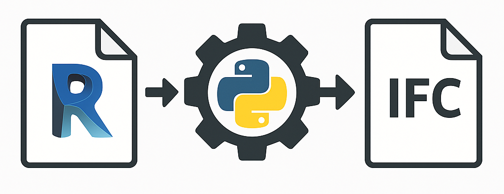
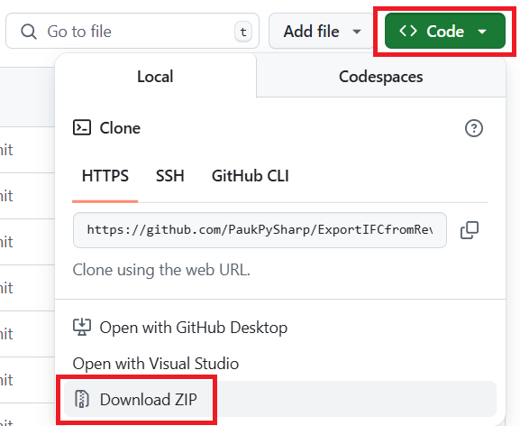

# ExportIFCfromRevit version 2.0.0

  Автоматическая выгрузка IFC из Autodesk Revit через Python и pyRevit с управлением через Excel-конфиги.

<p align="center">
  
</p>

> **ExportIFCfromRevit** (далее — **ExportIFC**) — это связка CPython-оркестратора и pyRevit-скрипта для массовой и автоматизированной выгрузки IFC-файлов из Revit-моделей.

---

## Кратко

**ExportIFC** состоит из двух основных частей:

- **CPython-оркестратор** (`main.py`), который:
  - читает настройки из `_settings/settings.ini` и `admin_data/manage.xlsx`,
  - формирует задачи для выгрузки,
  - вызывает pyRevit для нужных версий Revit;
- **pyRevit-скрипт** `ExportIFC.py`, который:
  - открывает модели в Revit,
  - ищет нужный 3D-вид,
  - выполняет экспорт IFC с учётом конфигураций.

Все проекты и задачи управляются через Excel и файловую структуру конфигов IFC.

---

## Для кого этот проект

- **BIM-координаторы / BIM-менеджеры / админы**, которые:
  - имеют доступ к машине, где установлены Revit и Python,
  - готовы редактировать `settings.ini` и Excel-файлы в `admin_data`,
  - отвечают за настройку pyRevit и планировщика задач.

Проект **не рассчитан** на рядовых проектировщиков: обычному пользователю достаточно знать, что выгрузка происходит автоматически; максимум — уметь запустить готовый батник.

---

## Основные возможности

- Автоматическая выгрузка IFC по расписанию (через Планировщик задач Windows).
- Поддержка **нескольких версий Revit** на одной машине.
- Управление задачами через `admin_data/manage.xlsx`:
  - пути к моделям,
  - целевые папки IFC (с маппингом и без),
  - ссылки на конфигурации IFC.
- Учёт истории в `admin_data/history/history.xlsx`:
  - выгружать только изменённые модели,
  - хранить дату/время последней успешной выгрузки.
- Логи по запускам и моделям:
  - общие логи оркестратора,
  - отдельные лог-файлы на уровне моделей/экспортов.
- Гибкая конфигурация IFC-экспорта:
  - общие настройки (`00_Common`),
  - варианты маппинга категорий/классов (`01_Export_Layers`),
  - проектные настройки (`02_Project_*`).

---

## Требования и подготовка окружения

Здесь — только кратко. Подробная пошаговая инструкция по установке и рекомендуемым версиям описана в [ExportIFC_manual](_docs/ExportIFC_manual.md).

- **ОС:** Windows 10 / 11.
- **Revit:** установлены все версии Revit, в которых будут открываться ваши модели.  
  Особенности разных версий и рекомендации по выбору см. в [ExportIFC_manual](_docs/ExportIFC_manual.md).
- **Python:** CPython 3.12+ (для запуска `main.py`).
- **pyRevit:** установленный pyRevit с подходящим engine (IronPython), привязанный к нужным версиям Revit.
- **IFC Exporter:** отдельной установки не требуется — используется экспортёр, который идёт в составе установленного Revit. DLL `Autodesk.IFC.Export.UI.dll` берётся из Revit и должна лежать в `_settings/ApiIFCExporter`.
- Все необходимые плагины, от которых зависят ваши модели (чтобы Revit не показывал диалоги/ошибки при автоматическом открытии).

---

## Установка и первый запуск (Quick start)

Минимальный сценарий, чтобы выгрузить **первый IFC**.

### 1. Скачайте или клонируйте репозиторий

- Через браузер на GitHub: `Code → Download ZIP`.

<p align="center">
  
</p>

- Или через Git:
```bash
git clone https://github.com/<user>/ExportIFCfromRevit.git
```

### 2. Установите зависимости Python

Перейдите в `_settings/bat/` и запустите:

- `install_openpyxl_pip_or_whl.bat` — установит `openpyxl` онлайн или из локального `.whl`.

Если интернета нет — используйте:

- `_settings/bat/openpyxl_offline_install/install_openpyxl_zip.bat`.

Подробности и альтернативы описаны в [README по bat-скриптам](_settings/bat/README.md).

### 3. Настройте `_settings/settings.ini`

В этом файле задаются основные пути и параметры:

- `dir_export_config` — путь к структуре конфигов IFC  
  (на старте можно просто скопировать `_examples/IFC_Export_Config_example` и прописать путь к копии).
- `dir_admin_data` — путь к папке `admin_data` (локально или на сервере).
- `revit_versions` — список версий Revit, которые должен использовать оркестратор.
- `export_view3d_name` — имя 3D-вида, который используется для экспорта.
- другие служебные параметры (режим работы, имена листов Excel и т.п.).

Подробное описание всех полей — в [ExportIFC_manual](_docs/ExportIFC_manual.md).

### 4. Подготовьте конфигурации IFC

- Скопируйте `_examples/IFC_Export_Config_example` в свою рабочую папку конфигов.
- При необходимости переименуйте папки вида `02_Project_*`.
- Адаптируйте JSON и `Property_Mapping.txt` под ваш проект:
  - общие настройки — в `00_Common`,
  - варианты маппинга категорий/классов — в `01_Export_Layers`,
  - конкретные настройки проекта — в `02_Project_*`.

Как устроена эта структура подробно описано в  
[Описание структуры конфигов IFC](_examples/IFC_Export_Config_structure.md).

### 5. Заполните `admin_data/manage.xlsx`

Добавьте хотя бы одну строку для тестовой модели:

- путь к папке с `.rvt`,
- пути, куда складывать IFC (с маппингом и без),
- ссылки на нужные IFC-конфиги (папки/имена настроек).

Точное описание колонок и листов таблицы — в [ExportIFC_manual](_docs/ExportIFC_manual.md).

### 6. Подключите нужный IronPython в pyRevit

В `_settings/bat/` есть скрипт:

- `attach_pyrevit_engine_all_revit.bat` — привязывает выбранный набор pyRevit и движок IronPython ко всем установленным версиям Revit.

Детали — в [README по bat-скриптам](_settings/bat/README.md).


### 7. Сделайте тестовый запуск

Запустите:

- `_settings/bat/run_export_ifc.bat`

Батник:

- вызовет `py -3 main.py`,
- прочитает `settings.ini` и `manage.xlsx`,
- сформирует временные файлы задач,
- запустит экспорты через pyRevit,
- покажет ход выполнения в консоли.

Результат можно проверить в целевых папках IFC и в `admin_data/history/history.xlsx`.

## Общий принцип работы

Вкратце пайплайн выглядит так:

1. **CPython-оркестратор (`main.py`)**:
   - читает `_settings/settings.ini` и `admin_data/manage.xlsx` (включая ignore-лист);
   - учитывает историю из `admin_data/history/history.xlsx`;
   - для каждой задействованной версии Revit формирует:
     - текстовый файл задач `Task_<версия>.txt`,
     - временный CSV с параметрами выгрузки;
   - запускает pyRevit (CLI) для указанных версий Revit.


2. **pyRevit-скрипт (`ExportIFC.py`)**:
   - по полученным заданиям/CSV:
     - открывает модели в нужной версии Revit,
     - находит заданный 3D-вид,
     - применяет настройки IFC и маппинг категорий/классов,
     - экспортирует IFC (одну или две версии — с маппингом и без);
   - записывает логи по каждой модели/экспорту.

3. **Результат**:
   - IFC-файлы в целевых папках;
   - обновлённый `history.xlsx`;
   - логи для диагностики проблемных моделей.

Более подробная схема по модулям (`core/`, `revit/`, `utils/`, `config/`) приведена в  
[ExportIFC_manual](_docs/ExportIFC_manual.md).


---

## Структура репозитория (в общих чертах)

- `main.py` — CPython-оркестратор: читает настройки, формирует задания, вызывает модуль Revit/pyRevit.
- `ExportIFC.py` — pyRevit-скрипт, который выполняет фактический экспорт IFC в контексте Revit.

- `core/` — основная логика оркестрации:
  - разбор `manage.xlsx` и ignore-листа,
  - формирование очереди задач,
  - учёт истории (`history.xlsx`),
  - формирование файлов задач и временных CSV,
  - запуск pyRevit.

- `revit/` — всё, что связано с Revit / Revit API:
  - чтение задач,
  - поиск 3D-вида,
  - настройка IFC-опций,
  - определение версии Revit по файлу модели и т.п.

- `config/` — конфигурация и пути:
  - чтение `_settings/settings.ini`,
  - построение путей к `admin_data`, логам, временным файлам,
  - описание структуры Excel (имена листов, индексы колонок).

- `utils/` — общие утилиты:
  - файловые операции,
  - запуск внешних процессов,
  - логирование,
  - вспомогательные функции для Excel.

- `admin_data/` — данные управления:
  - `manage.xlsx` — таблица задач по моделям,
  - `history/` — история выгрузок (`history.xlsx` и служебные файлы),
  - `_logs/` — логи работы оркестратора.

- `_settings/` — настройки и служебные скрипты:
  - `settings.ini` — основной конфигурационный файл,
  - `bat/` — батники для установки `openpyxl`, подключения pyRevit и запуска экспорта,
  - `ApiIFCExporter/Autodesk.IFC.Export.UI.dll` — DLL IFC-экспортёра, скопированная из установленного Revit и используемая в коде (путь и имя файла менять нельзя).

- `_docs/` — документация:
  - `ExportIFC_manual.md` — основная техническая инструкция,
  - `ExportIFC_manual_ru.docx` — то же самое в формате Word (с картинками),
  - `Run_schedule_example.md` — пример информационного файла с графиком запуска ExportIFC.

- `_examples/` — примеры конфигураций IFC:
  - `IFC_Export_Config_example/` — пример структуры конфигов,
  - `IFC_Export_Config_structure.md` и сопроводительная записка `.docx`.

- `_git_images/` — изображения для README и документации (логотип, диаграмма пайплайна, баннер Social preview, скриншот скачивания репозитория).

---

* * *
## Где это реально полезно (Use cases)

### Где инструмент особенно уместен

* Крупные проекты с большим количеством Revit-моделей, которые нужно регулярно выгружать в IFC для координации.
* Ночные / регулярные сборки (nightly build), когда выгрузка запускается по расписанию через Планировщик задач Windows, а утром в CDE/общей папке уже лежат свежие IFC.
* Сценарии, где важно централизовать конфигурации IFC (общие JSON/Property Mapping, структура `00_Common` / `01_Export_Layers` / `02_Project_*`) и применять их к нескольким моделям/проектам.
* Организации, где есть отдельный BIM-координатор / BIM-админ, который поддерживает структуру конфигов и Excel-управление, а проектировщики просто работают в Revit.

### Чего инструмент не делает и не планирует делать

* Не заменяет полноценную CDE-платформу (BIM 360, ACC, Dalux, Revizto и т.п.): ExportIFC отвечает только за выгрузку IFC и логику «что/когда выгружать».
* Не занимается проверкой/валидацией IFC по нормам, ILS/IDS или шаблонам заказчика — он лишь использует настроенные конфигурации экспорта Revit/IFC.
* Не управляет версиями Revit-моделей и не решает вопросы моделирования (качество геометрии, заполнение параметров, согласованность шаблонов и т.д.).
* Не предназначен для запуска с обычных пользовательских рабочих мест: предполагается выделенная «машина экспортов» с установленными Revit, Python и pyRevit.

---

## Документация

Подробные инструкции вынесены в отдельные файлы:

- [ExportIFC_manual](_docs/ExportIFC_manual.md) — **основная техническая инструкция** по настройке и эксплуатации.
- `_docs/ExportIFC_manual_ru.docx` — та же структура, но в Word-формате, с возможностью добавить скриншоты.
- [Описание структуры конфигов IFC](_examples/IFC_Export_Config_structure.md)  
  и `_examples/IFC_Export_Config_structure_notes_ru.docx` — подробности про структуру и логику конфигов IFC.
- [README по настройке окружения и bat-скриптов](_settings/README.md) — обзор папки `_settings`, батников запуска/установки и ссылки на вспомогательные README.

**Дополнительно:**

- [Run_schedule_example.md](_docs/Run_schedule_example.md) — пример информационного файла с графиком/описанием запуска ExportIFC (опциональная памятка, на работу пайплайна не влияет).

Рекомендуется начинать с [ExportIFC_manual](_docs/ExportIFC_manual.md).

---

## Статус проекта и лицензия

- Проект используется для автоматизации выгрузки IFC из Revit в рабочих условиях.
- Исходный код скриптов и утилит в этом репозитории распространяется по лицензии **MIT**  
  (см. файл `LICENSE` в корне).
- Сторонние компоненты (Revit, pyRevit, `Autodesk.IFC.Export.UI.dll` и др.) имеют
  собственные лицензии и в MIT-лицензию проекта **не входят**. Пользователь обязан
  соблюдать условия их правообладателей.

---

## Обратная связь и доработка

Если вы используете этот проект в своей компании и хотите:

- добавить новый сценарий экспорта,
- расширить конфигурации IFC,
- улучшить логирование или диагностику,

то имеет смысл оформлять изменения в виде pull request / issue (если репозиторий открыт)  
или хотя бы поддерживать свои форки синхронно с основной веткой.

За консультацией по настройке можно написать автору проекта в Telegram.