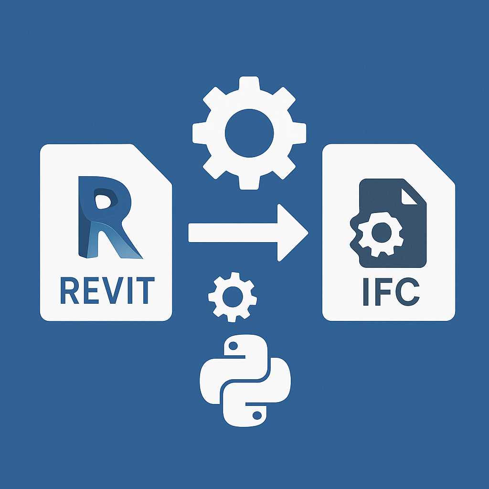

# ExportIFCfromRevit
Этот скрипт позволяет настроить автоматическую выгрузку IFC-файлов из Autodesk Revit.

**Чтобы скачать проект к себе на компьютер сделайте следующее**

## Как подготовить компьютер для выгрузки IFC
1. **Скачайте и установите Python (версия 3.10 или новее).**  
   - **Важно!** При установке обязательно поставьте галочку **"Add Python to PATH"** (это появится в самом начале мастера установки).
   - Ссылка для скачивания: [Python](https://www.python.org/downloads/)
   - После скачивания — откройте файл, несколько раз нажмите "Далее", остальное — по умолчанию.

2. **Установите все версии Revit, с которыми будут работать ваши модели.**  
   - Если ваши проекты делались в разных версиях Revit — все они должны быть установлены на этом компьютере.
   - Обратите внимание: в Revit 2022/2023 поздних update выгрузчик IFC может некорректно обрабатывать свойство "Категория".
   - **Рекомендуется использовать** версии **Revit 2022.1.5** и ниже, и **2023.0** — с ними всё работает надёжно.
   - Новые версии не тестировались, более старые поддерживаются.

3. **Поставьте плагин [pyRevit](https://github.com/pyrevitlabs/pyRevit/releases).**  
   - Инструкция по установке — на странице плагина.
   - Просто скачайте, запустите установщик, следуйте подсказкам.

4. **Если ваши модели использовали сторонние плагины — установите и их.**  
   - Иначе при автоматической работе скрипта возможны ошибки.

5. **Дальнейшие подробности и все особенности работы — в расширенной инструкции:**  
   - [Инструкция по процессу выгрузки IFC](_инструкция/Основная_инструкция_выгрузок_IFC.docx)

---

> **P.S.**  
> Рекомендуется установить удобный редактор кода:  
> - [Visual Studio Code](https://code.visualstudio.com/) (очень удобно)  
> - или [Notepad++](https://notepad-plus-plus.org/)  
> Это не обязательно, но сильно упростит настройку и редактирование скриптов.

> **P.P.S.**  
**Чтобы скачать проект к себе на компьютер сделайте следующее**

