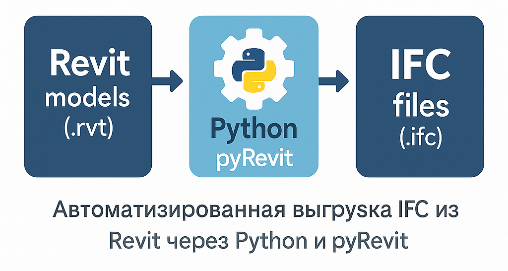

# ExportIFCfromRevit — технический мануал (ExportIFC_manual)

## 1. Вступление и аудитория

### 1.1. Что такое ExportIFC

**ExportIFC** — это связка обычного CPython-скрипта и pyRevit, которая:

- по списку моделей, указанному в файле `admin_data/<MANAGE_NAME>.xlsx` (по умолчанию `manage.xlsx`, имя задаётся в `config/constants.py`),
- для каждой модели выбирает нужную версию Revit,
- запускает Revit через pyRevit и выполняет экспорт IFC, в том числе с учётом IFC-конфигов (JSON) и маппингом категорий (TXT), либо без маппинга (если включена опция `enable_unmapped_export`),
- складывает IFC-файлы в нужные папки,
- ведёт историю запусков и логирует все шаги.

Основные настройки живут в:

- `_settings/settings.ini` — общие пути, версии Revit и флаги работы;
- конфигурациях IFC (в примере конфигов `_examples/IFC_Export_Config_example` — общие папки `00_Common`, `01_Export_Layers` и проектные подпапки вроде `02_Project_example`; реальные папки проектов под `dir_export_config` могут называться по-своему);
- `admin_data/manage.xlsx` и `admin_data/history/history.xlsx`.

Этот файл (`ExportIFC_manual.md`) — **подробный технический мануал** по настройке и эксплуатации ExportIFC. Краткое описание и «быстрый старт» вынесены в основной ([README репозитория](../README.md)); здесь — расширенная версия с деталями.

---

### 1.2. Для кого предназначен этот документ

Этот мануал рассчитан на людей, которые **отвечают за инфраструктуру и автоматизацию**, а не просто «умеют открыть Revit».

Основные роли:

- **BIM-координатор / BIM-менеджер**:
  - понимает структуру моделей Revit в проекте;
  - готов настраивать IFC-конфиги (или хотя бы передавать их специалисту);
  - может проверять корректность выгрузки IFC.

- **Технический специалист / администратор**:
  - устанавливает и обновляет Python;
  - настраивает pyRevit и привязку скрипта `ExportIFC.py`;
  - редактирует `_settings/settings.ini`;
  - отвечает за Планировщик задач Windows и права доступа к сетевым папкам.

Кому этот документ **не нужен**:

- **Рядовым проектировщикам**.  
  В идеальном мире им достаточно:
  - знать, что выгрузка IFC происходит автоматически,
  - уметь при необходимости запустить готовый `.bat`-файл вручную
    (и то не всегда).

Для проектировщиков может существовать отдельная короткая инструкция/Word-файл «что делать, если IFC не обновился». Здесь мы сознательно не опускаем уровень подробностей ради удобства админов и координаторов.

---

### 1.3. Как пользоваться этим документом

В документе принята следующая логика:

- **Раздел 2. Обзор архитектуры** — что вообще происходит «под капотом»:
  - как взаимодействуют CPython-часть (`main.py`) и pyRevit-скрипт (`ExportIFC.py`);
  - какую роль играют `settings.ini`, `admin_data` и конфиги IFC.

- **Раздел 3. Быстрый старт** — пошаговый сценарий «настроить всё с нуля».  
  Если вы впервые ставите ExportIFC на машине/в компании — начинайте отсюда.

- **Разделы 4–9** — справочная часть:
  - требования к окружению и минимальные версии софта (Раздел 4),
  - структура проекта и ролей папок (Раздел 5),
  - настройка `_settings/settings.ini` (Раздел 6),
  - структура конфигов IFC (Раздел 7),
  - структура `admin_data` и логика работы `manage.xlsx` и `history.xlsx` (Раздел 8),
  - требования к самим Revit-моделям (Раздел 9).

- **Раздел 10. Запуск и сценарии эксплуатации**:
  - ручной запуск через `_settings/bat/run_export_ifc.bat`, запуск по расписанию;
  - сценарий настройки нового проекта;
  - перенос готовой настройки на другую машину.

- **Раздел 11. Диагностика и устранение неполадок**:
  - как читать логи;
  - как пользоваться `history.xlsx`;
  - типовые проблемы и пути их решения.

- **Раздел 12. Рекомендации и связанные документы**:
  - советы по структуре папок и путей;
  - ссылки на другие `.md` и примеры внутри репозитория;
  - ссылка на Word-версию мануала (если она используется в компании).

#### Если вы настраиваете всё с нуля

Рекомендуемая последовательность чтения и действий:

1. **Раздел 2** — понять общую архитектуру (что за что отвечает).
2. **Раздел 3** — пройти по чек-листу «Быстрый старт».
3. По ходу выполнения шагов из Быстрого старта, при необходимости:
   - заглядывать в **Раздел 4** (требования и софт),
   - **Раздел 6** (настройка `settings.ini`),
   - **Раздел 7** (конфиги IFC),
   - **Раздел 8** (настройка `admin_data`),
   - **Раздел 9** (требования к моделям).
4. Завершить на **Разделе 10** (варианты запуска и запуск по расписанию).

#### Если «раньше всё работало, а теперь нет»

1. Сначала смотрим **Раздел 11**:
   - по уровням логов и сообщениям в `_logs` обычно видно, в какой части цепочки проблема.
2. В зависимости от симптомов:
   - если не запускается вообще — сверяемся с **Разделом 4** (окружение) и **Разделом 10** (способ запуска);
   - если не находится/не выгружается конкретная модель — **Раздел 8** и **Раздел 9**;
   - если IFC выгружается «не так» — **Раздел 7** (конфиги IFC).

#### Если вы разработчик, дорабатывающий ExportIFC

Этот мануал описывает **поведение системы и контракты на уровне модулей и данных**.  
Он **не является подробной API-документацией**: внутренняя реализация отдельных функций и классов в `core`, `revit`, `config` и `utils` здесь не разбирается.

Рекомендуемая стратегия:

- использовать этот документ как описание «как должно работать»;
- при изменении поведения:
  - сначала менять код и автотесты (если есть),
  - затем актуализировать соответствующие разделы мануала (чаще всего 2, 6, 7, 8, 10, 11);
  - не забывать сверять краткий [README репозитория](../README.md) и `ExportIFC_manual.md`, чтобы они не противоречили друг другу.

---

## 2. Обзор архитектуры

### 2.1. Общая схема работы

Высокоуровнево цепочка выглядит так:

1. **Запуск оркестратора (CPython)**  
   Вы запускаете оркестратор через bat-файл `_settings/bat/run_export_ifc.bat`  
   (под капотом он вызывает `main.py` с нужными флагами).  
   `main.py`:
   - настраивает логирование;
   - находит корень проекта и читает `_settings/settings.ini`;
   - создаёт и запускает фасад `ExportOrchestrator`.

2. **Загрузка настроек и списка моделей**  
   Внутри `ExportOrchestrator`:
   - через `config` загружаются пути и параметры из `settings.ini`;
   - из `admin_data/manage.xlsx` читается список моделей и настроек по ним;
   - из `admin_data/history/history.xlsx` — история прошлых выгрузок.

3. **Проверка актуальности IFC и формирование задач**  
   Оркестратор:
   - для каждой модели:
     - определяет, **нужна ли выгрузка** (по истории и реальным IFC-файлам на диске);
     - лениво определяет версию Revit по самому файлу `.rvt`;
   - группирует модели по версиям Revit;
   - формирует для каждой версии:
     - `Task<версия>.txt` (например, `Task2024.txt`) — список путей к моделям для pyRevit;
     - временный CSV `<TMP_NAME>.csv` (по умолчанию `tmp.csv`, имя задаётся константой `TMP_NAME` в `config/constants.py`) с полным набором параметров экспорта.

4. **Запуск pyRevit по версиям Revit**  
   Для каждой версии, где есть задания:

   - запускается pyRevit CLI командой вида  
     `pyrevit run ExportIFC.py --models=Task<версия>.txt --revit=<версия> [--debug]`;
   - в переменной окружения `EXPORTIFC_ROOT` в дочерний процесс пробрасывается путь к скриптам ExportIFC,  
     чтобы внутри Revit тот же `settings.ini` и та же структура путей были доступны.

5. **Работа pyRevit-скрипта внутри Revit**  
   Скрипт `ExportIFC.py`, выполняющийся **внутри** запущенного Revit:

   - читает `admin_data/<TMP_NAME>.csv`;
   - по каждой строке:
     - открывает соответствующую модель (если она ещё не открыта);
     - ищет 3D-вид для экспорта по имени из `settings.ini`;
     - готовит `IFCExportOptions` (по JSON-конфигу и файлу маппинга);
     - выполняет экспорт с маппингом и/или без;
     - логирует ошибки и предупреждения (отдельные текстовые логи).

   Все знания о Revit API, 3D-видах, IFCExportOptions живут именно тут.

6. **Обновление истории и финальные логи**  
   После завершения всех версий оркестратор:

   - обновляет `history.xlsx` (факт последней «проверки/экспорта» по каждой модели);
   - записывает сводки по версиям и проблемным моделям;
   - добавляет разделители в текстовые логи pyRevit за этот запуск (чтобы в `_logs` было видно блоками по запускам).

При следующем запуске именно эта связка **«history + реальные IFC-файлы на диске»** позволяет понимать, какие модели можно пропустить, а какие нужно выгружать заново.

Схематично эта цепочка показана на диаграмме ниже.



---

### 2.2. Компоненты CPython-части

#### 2.2.1. Точка входа: `main.py`

`main.py` — минималистичная оболочка для запуска оркестратора:

- настраивает корневой логгер (`export_ifc`), консольный вывод и файлы логов;
- создаёт `ExportOrchestrator(debug=..., run_pyrevit=...)`;
- вызывает `orchestrator.run()` и возвращает код возврата процесса (0 — успех, 1 — ошибки).

Поведение запуска управляется двумя флагами в начале файла:

- **`DEBUG: bool`**  
  - `False` — обычный режим;  
  - `True` — к команде запуска pyRevit добавляется `--debug`, pyRevit больше пишет в консоль/логи.  
  **Когда использовать:** при отладке проблем с запуском pyRevit или экспортом, чтобы видеть дополнительную диагностику.

- **`RUN_PYREVIT: bool`**  
  - `True` — полный сценарий: формирование Task/CSV, обновление `history.xlsx`, запуск pyRevit-скрипта;  
  - `False` — **dry-run**: формируются Task/CSV и обновляется история, **но pyRevit не вызывается**.  
  **Когда использовать:**  
  - при первичной настройке `manage.xlsx` и путей, чтобы проверить, какие модели попадут в задачи, не поднимая Revit;  
  - при отладке логики отбора моделей и истории.

Важно: при импорте `main.py` **ничего не запускается** — он безопасен для автотестов и внешних инструментов.  
Запуск происходит только в блоке `if __name__ == "__main__":`.

#### 2.2.2. Ядро оркестрации: пакет `core/`

Пакет `core` содержит весь «бизнес-процесс» экспорта IFC на стороне CPython:

- **`core/exporter.py` → `ExportOrchestrator`**  
  Фасад, который:

  - загружает список моделей и ignore-list из `manage.xlsx`;
  - загружает историю из `history.xlsx`;
  - с помощью `IFCChecker` проверяет актуальность IFC-файлов на диске;
  - через `ExportTaskManager` решает, какие модели требуют выгрузки и в какие версии Revit их отправить;
  - вызывает `PyRevitRunner` для каждой версии Revit;
  - сохраняет историю и пишет сводку логов.

- **`core/manage.py`**  
  Загрузка `<MANAGE_NAME>.xlsx` (по умолчанию `manage.xlsx`, имя задаётся в `config/constants.py`):

  - список моделей `RevitModel`;
  - множество игнорируемых путей;
  - предупреждения по подозрительным датам (`mtime`).

  При чтении `manage.xlsx` и подготовке задач учитываются:
  - имена листов (`SHEET_PATH`, `SHEET_IGNORE`) и индексы колонок из `config.excel`;
  - проверка существования JSON-конфига и файла маппинга на диске (если нужные файлы не найдены, строка помечается как некорректной, а информация об этом уходит в основной логгер — её видно и в консоли, и в общем лог-файле запуска);
  - автоматическое создание выходных папок для IFC: для путей из колонок B и (при включённой nomap-выгрузке) E вызывается `_prepare_output_dirs()`, которая через `ensure_dir(...)` создаёт директории при отсутствии и ничего не делает, если они уже есть.

- **`core/models.py` → `RevitModel`**  
  Описывает одну модель Revit:

  - путь к `.rvt`,
  - директории для выгрузки IFC (mapped/nomap),
  - файлы JSON-конфигов и маппинга,
  - лениво определяемую версию Revit и номер сборки,
  - методы `needs_export(...)` и `expected_ifc_path_*()`.

- **`core/history.py` → `HistoryManager`**  
  Работа с `<HISTORY_NAME>.xlsx` (по умолчанию `history.xlsx`, имя задаётся в `config/constants.py`):

  - хранение [путь к .rvt → дата последней выгрузки/проверки];
  - чтение/запись в формате Excel, с округлением дат до минут;
  - полная перезапись листа при сохранении.

- **`core/ifc_checker.py` → `IFCChecker`**  
  Сравнение **mtime IFC-файлов** с **mtime `.rvt`**:

  - умеет проверять отдельно сценарий с маппингом (mapped) и без (nomap);
  - учитывает только актуальные файлы (по времени «не старее модели»);
  - использует внутренний кэш, чтобы не перечитывать содержимое каталогов на каждом шаге.

- **`core/tasks.py` → `ExportTaskManager`**  

  - распределяет модели по поддерживаемым версиям Revit;
  - формирует `Task<версия>.txt` для pyRevit (список путей к моделям);
  - создаёт временный CSV `<TMP_NAME>.csv` (по умолчанию `tmp.csv`, имя задаётся в `config/constants.py`) с колонками:  
    `path;output_dir_mapping;mapping_json;family_mapping_file;output_dir_nomap;nomap_json` (подробности см. Разделы 8.3–8.4);
  - собирает «корзину логов» по проблемным моделям (не определилась версия, версия слишком новая и т.п.).

- **`core/pyRevit_runner.py` → `PyRevitRunner`**  

  - запускает pyRevit CLI для конкретной версии:
    - `pyrevit run <SCRIPT_EXPORT_IFC> --models=Task<версия>.txt --revit=<версия> [--debug]`;
  - устанавливает переменную среды `EXPORTIFC_ROOT=DIR_SCRIPTS`;
  - возвращает код возврата процесса, чтобы оркестратор понимал, был ли запуск успешным.

- **`core/console_output.py`, `core/__init__.py`**  

  Вспомогательные вещи:

  - оформление консольного вывода (красивые теги уровней логов, цвета);
  - документация назначения пакета `core` как «ядра» экспорта.

#### 2.2.3. Конфигурация: пакет `config/`

Пакет `config` отвечает за настройки, пути и константы:

- **`config/settings.py` → `Settings` (Singleton)**  

  - ищет корень проекта (`main_dir`) по следующему приоритету:
    1. `EXPORTIFC_ROOT` (если в нём есть `config/` и `utils/`);
    2. расположение самого пакета `config`;
    3. `sys.argv[0]`;
  - находит и читает `_settings/settings.ini`;
  - предоставляет доступ к параметрам через свойства (с приводом типов).

  **Для администратора:** в 99% случаев изменять нужно именно `_settings/settings.ini`, а не сам модуль `config.settings`.

- **`config/paths.py`**  

  - формирует абсолютные пути:
    - `DIR_SCRIPTS` (где лежат `main.py` и `ExportIFC.py`);
    - `DIR_EXPORT_CONFIG` (папка с конфигами IFC);
    - `DIR_ADMIN_DATA` (папка с `manage.xlsx`, `history`, `_logs`);
    - `DIR_HISTORY`, `DIR_LOGS` и т.п.;
  - проверяет существование ключевых папок при импорте (ошибка конфигурации — сразу исключение).

- **`config/files.py`**  

  - даёт удобные функции:
    - `MANAGE_PATH`, `HISTORY_PATH`;
    - `build_task_path(version)` → `admin_data/Task<версия>.txt`;
    - `build_csv_path(...)` → путь к `<TMP_NAME>.csv` (по умолчанию в `admin_data`);
    - `SCRIPT_EXPORT_IFC` → путь к `ExportIFC.py` рядом с `main.py`.

- **`config/excel.py`**  

  - описывает, какие листы и какие индексы столбцов используются в `manage.xlsx` и `history.xlsx`;
  - фиксирует «контракты» Excel-таблиц, чтобы их можно было менять централизованно.

- **`config/constants.py`**  

  - глобальные константы проекта:
    - базовые имена (`TMP_NAME`, `MANAGE_NAME`, `HISTORY_NAME`);
    - имя логгера (`LOGGER_NAME`);
    - формат даты/времени;
    - имена файлов логов (`LOGFILE_OPENING_ERRORS`, `LOGFILE_MISSING_NAVIS_VIEW`, `LOGFILE_VERSION_NOT_FOUND` и т.п.);
    - путь к DLL IFC Exporter: `_settings/ApiIFCExporter/Autodesk.IFC.Export.UI.dll`.

  **Для администратора:**  
  - здесь можно теоретически переопределить имена служебных файлов (`MANAGE_NAME`, `HISTORY_NAME`, `TMP_NAME`) и логов,  
    но делать это стоит только при полном понимании последствий: придётся синхронно править имена файлов в `admin_data`,  
    примерах из `_examples` и документации. В обычной эксплуатации эти значения **лучше не трогать**.

- **`config/__init__.py`**  

  - собирает всё нужное в единый фасад `config` (через `__all__`), чтобы остальной код мог писать просто `from config import ...`
    и не заботиться о конкретных модулях.

#### 2.2.4. Вспомогательные утилиты: пакет `utils/`

Пакет `utils` содержит «инфраструктурные» куски, не привязанные к бизнес-логике:

- **`utils/compat.py`**  
  - функции совместимости для разных версий Python/Windows; безопасное создание директорий (`ensure_dir_compat`), корректная обработка параллельных попыток создать одну и ту же папку (`EEXIST` и т.п.).

- **`utils/log_buckets.py`**  
  - «корзины» логов для оркестратора и pyRevit-части (структуры, которые аккумулируют строки сообщений/ошибок перед записью в текстовые `.txt`-логи).

- **`utils/logs.py`**  
  - функции записи логов в каталог `_logs`: создание/дополнение файлов, добавление заголовков и разделителей, сохранение содержимого «корзин» в физические лог-файлы.

- **`utils/fs.py`**  
  - низкоуровневая работа с файловой системой поверх `compat`: безопасное создание директорий (`ensure_dir`), проверка существования путей, получение/сравнение `mtime` (`file_mtime`, `file_mtime_minute`).

- **`utils/files.py`**  
  - хелперы для имён файлов: гарантированное добавление расширений (`ensure_ext`), проверка «чистоты» `.rvt` без дополнительных суффиксов (`is_pure_rvt`), формирование базовых имён логов с подстановкой имени 3D-вида (`format_log_name_with_view`).

- **`utils/cli.py`**  
  - запуск внешних процессов с построчным чтением вывода (`run_cmd_streaming`), получение коротких путей Windows (`get_short_path`), безопасное экранирование путей и аргументов для командной строки (`safe_path`).

- **`utils/xlsx_helpers.py`**  
  - вспомогательные функции для работы с Excel через `openpyxl`: загрузка/создание книг, безопасное сохранение, базовые операции с листами/ячейками (чтение, запись, очистка служебных артефактов).

---

### 2.3. Компоненты pyRevit-части и пакет `revit/`

Все, что касается **непосредственной работы внутри Revit**, сосредоточено в:

- скрипте **`ExportIFC.py`** (лежит рядом с `main.py`);
- пакете **`revit/`**, который исполняется под IronPython 3.4 в контексте pyRevit.

#### 2.3.1. Скрипт `ExportIFC.py` (pyRevit)

Основные задачи:

- запуститься из pyRevit в нужной версии Revit;
- прочитать `admin_data/<TMP_NAME>.csv` и превратить строки в `ExportJob`;
- для каждой строки:
  - открыть модель (если она ещё не открыта);
  - найти 3D-вид для экспорта;
  - подготовить `IFCExportOptions` на основе JSON-конфигов и маппинга;
  - выполнить экспорт IFC (в одном или двух вариантах: с маппингом и без него);
  - выполнить экспорт внутри транзакции Revit и **всегда** откатить её методом `RollBack`, чтобы не вносить изменений в модель;
  - записать информацию о проблемах (не открылась модель, не найден вид, ошибка экспорта) в текстовые логи.

При этом `ExportIFC.py`:

- использует тот же `_settings/settings.ini`, что и CPython-часть (через `EXPORTIFC_ROOT` и `Settings`);
- не определяет версию Revit для файла `.rvt` — эту работу заранее делает CPython-оркестратор.

Важная точка настройки для продвинутых админов/разработчиков:

- **Метод `_build_open_options()`** внутри класса исполнителя экспорта:

  - создаёт и настраивает `DB.OpenOptions` для пакетного открытия моделей;
  - по умолчанию:
    - отсоединяет модель от центральной с сохранением рабочих наборов;
    - открывает все рабочие наборы;
    - разрешает открытие локального файла «не тем» пользователем;
    - игнорирует конфликты схем Extensible Storage;
    - разрешает открытие иностранных элементов.

  **Когда и зачем его трогать:**

  - если политика компании требует иного поведения при открытии моделей  
    (например, не отсоединять от центральной, не открывать все рабочие наборы и т.п.);
  - изменение этого метода влияет только на поведение экспорта,  
    но не меняет формат CSV/Excel и остальную архитектуру.

  Если вы не уверены, что делаете — лучше оставить `_build_open_options()` как есть: текущие настройки оптимизированы под безопасную пакетную выгрузку.

#### 2.3.2. Пакет `revit/`

Ключевые модули:

- **`revit/task_reader.py`**  
  - читает `admin_data/<TMP_NAME>.csv`;
  - создаёт список `ExportJob` с полями:
    - путь к `.rvt`,
    - каталоги выгрузки (mapped/nomap),
    - пути к JSON-конфигам и файлу маппинга.

- **`revit/jobs.py` → `ExportJob`**  
  - контейнер параметров экспорта для одной модели:
    - используется `ExportIFC.py` для выполнения экспорта.

- **`revit/views.py`**  
  - поиск 3D-вида `View3D` по имени из `settings.ini` (`export_view3d_name`);
  - исключает шаблонные виды;
  - возвращает `None`, если подходящий вид не найден (такие случаи логируются отдельно).

- **`revit/ifc_options.py`**  
  - загрузка JSON-конфигов IFC;
  - подготовка и настройка `IFCExportOptions` и `IFCExportConfiguration` через `Autodesk.IFC.Export.UI.dll`;
  - приведение типов и спец-полей (даты, ActivePhaseId и т.п.).

- **`revit/versions.py`**  
  - утилита для определения **версии Revit** и **build** из бинарного `.rvt` (по строковым маркерам `Format:`, `Build:` и т.п.).  
    Используется на стороне CPython (через `RevitModel.load_version()`), чтобы не запускать Revit только ради определения версии.

- **`revit/_api.py`**  
  - тонкая прослойка над Revit API (DB, UI, коллекции элементов), чтобы упростить импорт и сократить явную «болванку» кода.

---

### 2.4. Основные файлы данных и потоки

С точки зрения пользователя есть несколько ключевых сущностей:

- **Конфигурация и настройки**:
  - `_settings/settings.ini` — глобальные пути, версии Revit, имена листов Excel, имена подпапок маппинга и т.п. (подробно в Разделе 6);
  - конфиги IFC (общие, слоёв, проектные папки — см. Раздел 7 и [Описание структуры конфигов IFC](../_examples/IFC_Export_Config_structure.md)).

- **Управляющие Excel-файлы**:
  - `admin_data/manage.xlsx` — список моделей и их настроек (Раздел 8);
  - `admin_data/history/history.xlsx` — история экспортов по моделям (Раздел 8 и 11).

- **Служебные файлы задач**:
  - `admin_data/Task<версия>.txt` (например, `Task2024.txt`) — список путей к моделям для pyRevit
  - `admin_data/<TMP_NAME>.csv` (по умолчанию `tmp.csv`) — временный CSV с полным набором параметров экспорта для текущей версии Revit.

- **Результаты и логи**:
  - целевые IFC-файлы — складываются в каталоги, которые оркестратор рассчитывает на основе путей из `manage.xlsx` (с учётом того, используем ли мы выгрузку с маппингом и без него);
  - текстовые логи в `admin_data/_logs/`:
    - часть пишет оркестратор (версии не найдены, версии слишком новые, проблемы с датами и т.п.);
    - часть — pyRevit-скрипт (ошибки открытия файлов, отсутствие 3D-вида, ошибки экспорта).

---

### 2.5. Что важно запомнить из архитектуры

1. **Выбор версии Revit и решение «что вообще экспортировать» — всегда делает CPython-часть.**  
   pyRevit-скрипт работает уже *внутри* нужной версии Revit и просто выполняет экспорт по заранее подготовленным задачам.

2. **Обе части используют один и тот же `settings.ini` и одну и ту же структуру проекта.**  
   За счёт `EXPORTIFC_ROOT` и общей логики `Settings` можно запускать оркестратор и pyRevit из разных контекстов, но с едиными настройками.

3. **Реальное состояние IFC берётся с диска, а `history.xlsx` — это кеш для ускорения принятия решения.**  
   При любых сомнениях экспортер смотрит и на историю, и на реальные файлы, а не полагается слепо только на Excel.

4. **У администратора есть несколько контролируемых «крутилок», но большинство настроек живёт в `settings.ini` и Excel.**  
   Флаги `DEBUG` и `RUN_PYREVIT` в `main.py`, метод `_build_open_options()` в `ExportIFC.py` и константы в `config/constants.py` — это уже уровень «тонкой настройки», который нужно трогать осознанно.

Дальше в Разделе 3 мы разложим эту архитектуру в виде конкретного **«Быстрого старта»** — что именно нужно установить, куда положить конфиги и как сделать первый успешный прогон.

---

## 3. Быстрый старт

Этот раздел — короткий чек-лист, как **с нуля** получить первый успешный экспорт IFC.  
Подробности по каждому шагу разобраны дальше в разделах 4–10.

---

### 3.1. Что должно быть готово до начала

Перед тем как лезть в настройки ExportIFC, убедитесь, что:

1. **Revit** нужных версий уже установлен.
2. **IFC Exporter** не требует установки отдельного инсталлятора.  
   Используется модуль, который идёт с Revit, но его DLL один раз нужно вручную скопировать из каталога установленного Revit в папку `_settings/ApiIFCExporter` (подробно — в Разделе 4).
3. **Python 3.12+** уже установлен в системе (минимальная версия — 3.12).  
   Если вы ещё не ставили Python или не уверены в версии, сначала выполните шаги из Раздела 4  
   и проверьте установку, а затем вернитесь к этому чек-листу.
4. **pyRevit** установлен и базово работает в Revit,  
   его движок переключён на нужную версию IronPython 3.4 (например, 3.4.2), совместимую с используемой версией pyRevit; привязка делается bat-скриптами из `_settings/bat/attach_pyrevit_engine_all_revit.bat`  
   (подробности — см. Раздел 3.3, Раздел 4, [README репозитория](../README.md)  
   и [README для bat-скриптов](../_settings/bat/README.md)).
5. У вас есть права читать/писать:
   - в папку с моделями Revit;
   - в папку `admin_data`;
   - в папки, куда будут складываться IFC.

Если какой-то пункт не выполняется — имеет смысл сначала дочитать Раздел 4  
и основной [README репозитория](../README.md), а потом возвращаться к этому чек-листу.

---

### 3.2. Подготовка репозитория и установка openpyxl

1. **Скачайте или клонируйте репозиторий `ExportIFCfromRevit`.**

   - Через браузер на GitHub: используйте кнопку `Code → Download ZIP`.  
     За примером можно посмотреть раздел «Установка и первый запуск (Quick start)»  
     в основном [README репозитория](../README.md), там приведён скриншот кнопки и пояснения.

   - (Опционально) Через Git, если он установлен:  
     выполните в терминале команду  
     ```bash
     git clone https://github.com/PaukPySharp/ExportIFCfromRevit.git
     ```

   - После скачивания/клонирования переместите (или сразу клонируйте) репозиторий в удобное место,  
     например:  
     `D:\BIM\ExportIFCfromRevit`

2. **Проверьте запуск Python из корня репозитория** (в терминале):

   Выполните команду:  
    ```bash
    py -3 --version
    ```
    Данная команда предполагает, что в системе установлен Python Launcher и Python версии не ниже 3.12 (рекомендуется 3.12+).

   Если команда не находится или версия ниже требуемой — вернитесь к установке Python  
   (см. Раздел 4 и [README репозитория](../README.md)).

3. **Установите библиотеку `openpyxl` через готовый bat-скрипт.**

   Перейдите в папку `_settings/bat/` внутри репозитория и запустите:

   - `install_openpyxl_pip_or_whl.bat` — основной вариант.  
     Скрипт сам:
       - проверит, установлен ли `openpyxl` для используемого Python;
       - попробует установить его через интернет;
       - при необходимости поставит пакет из локальных `.whl`  
         в папке `_for_python/openpyxl`.

   Если интернета **нет вообще** и вариант с `install_openpyxl_pip_or_whl.bat` не сработал, используйте:

   - `openpyxl_offline_install/install_openpyxl_zip.bat` — полностью офлайн-вариант.

   Подробности и альтернативы описаны в [README для bat-скриптов](../_settings/bat/README.md)  
   и [README для offline-bat](../_settings/bat/openpyxl_offline_install/README.md).

---

### 3.3. Краткая проверка установки pyRevit

Для работы ExportIFC pyRevit должен быть:

- установлен для нужных версий Revit;
- привязан к движку IronPython 3.4 (например, 3.4.2), совместимый с используемой версией pyRevit;
- доступен через команду `pyrevit` в консоли (для запуска через CLI).

Минимальная проверка:

1. **Проверьте наличие вкладки pyRevit в Revit.**  
   Откройте любую поддерживаемую версию Revit и убедитесь, что в интерфейсе есть вкладка `pyRevit`.  
   Если её нет — сначала установите pyRevit (см. Раздел 4 и документацию pyRevit).

2. **Привяжите нужный движок IronPython ко всем версиям Revit.**  
   Запустите файл:  
   `_settings/bat/attach_pyrevit_engine_all_revit.bat`.

   Скрипт:

   - использует утилиту `pyrevit` (или полный путь к ней — см. комментарии внутри bat-файла);
   - настраивает указанный clone pyRevit (по умолчанию `master`);
   - подключает выбранный движок (например, 342 для IronPython 3.4.2) ко всем установленным версиям Revit.

3. **Проверьте, что pyRevit CLI доступен.**  
   В командной строке выполните, например, команду  
    ```bash
    pyrevit --help
    ```

   Если команда не находится:

   - проверьте, установлен ли pyRevit;
   - убедитесь, что путь к `pyrevit.exe` добавлен в `PATH`,  
     либо пропишите его напрямую в `_settings/bat/attach_pyrevit_engine_all_revit.bat`  
     (переменная `PYREVIT_CLI`);
   - при необходимости загляните в [README репозитория](../README.md)  
     и [README для bat-скриптов](../_settings/bat/README.md).

Этого уровня проверки достаточно для «Быстрого старта».  
Все детальные нюансы работы pyRevit, версий движка и т.п. раскрываются в Разделе 4.

---

### 3.4. Минимальная настройка `_settings/settings.ini`

Файл `_settings/settings.ini` — главный конфигурационный файл ExportIFC.  
Для первого запуска достаточно настроить **минимальный набор ключей**  
(точные имена/типы будут в Разделе 6):

1. **Путь к папке с IFC-конфигами. Секция `[Paths]`**

   Пример значения:

   `dir_export_config = D:\BIM\IFC_Configs`

   Эта папка будет содержать ваши `00_Common`, `01_Export_Layers` и набор подпапок с конфигами проектов (в примере используются имена вида `02_Project_*`, но реальные имена папок могут быть любыми).  
    На старте можно просто скопировать туда пример  
    `_examples/IFC_Export_Config_example` (см. Разделы 3.5, 5 и 7).

2. **Путь к `admin_data`. Секция `[Paths]`**

   Примеры значений:

   `dir_admin_data = D:\BIM\admin_data`  
   `dir_admin_data = \\SERVER\BIM\admin_data`

   Здесь будут лежать `manage.xlsx`, папка `history` (с `history.xlsx`)  
   и папка `_logs` со служебными логами.

3. **Список поддерживаемых версий Revit. Секция `[Revit]`**

   Пример значения:

   `revit_versions = 2021,2022,2023,2024`

   Укажите только те версии, которые реально установлены на машине выгрузки  
   и используются в ваших проектах.

4. **Имя 3D-вида для экспорта. Секция `[Revit]`**

   Пример значения:

   `export_view3d_name = Navisworks`

   Это имя удобно использовать, потому что Navisworks по умолчанию тоже  
   использует вид `Navisworks` для импорта — можно «убить двух зайцев» одним видом.

   В каждой модели Revit должен существовать не шаблонный 3D-вид с таким именем  
   (см. Раздел 3.7 и Раздел 9).

Остальные параметры файла `_settings/settings.ini` на первом этапе можно оставить по умолчанию.  
Подробное описание всех настроек приведено в Разделе 6.

---

### 3.5. Подготовка конфигов IFC на основе примера

Для первого запуска проще всего взять готовый пример конфигурации IFC:

1. В репозитории найдите папку с примером:  

   `../_examples/IFC_Export_Config_example`

2. Скопируйте её содержимое в папку, указанную в `dir_export_config`, например:

   `D:\BIM\IFC_Configs`

3. Для теста можно **использовать пример как есть**:

   - не менять `00_Common` и `01_Export_Layers`;
   - оставить `02_Project_example` как демонстрационный проект.

4. Позже, когда вы получите первый успешный экспорт, можно:

   - создать свою папку с конфигами проекта (чаще всего внутри `dir_export_config`, например `02_<Название_проекта>`; фактический путь до этой папки потом целиком попадает в колонку C `manage.xlsx` как абсолютный путь);
   - скопировать туда содержимое `02_Project_example`;
   - адаптировать `Export_Settings.json` / `Export_Settings_NotAttributes.json` и `Property_Mapping.txt` под свой проект.

Подробная структура конфигов IFC описана в Разделе 5 и 7  
и в отдельном документе  
[Описание структуры конфигов IFC](../_examples/IFC_Export_Config_structure.md).

---

### 3.6. Подготовка `admin_data` и `manage.xlsx`

1. **Выберите, где будет находиться `admin_data`.**

   В репозитории уже есть готовая папка-шаблон:

   `...\ExportIFCfromRevit\admin_data\`

   Варианта использования два:

   - **Локальный тест / одиночная машина (тестовый режим).**  
     В файле `_settings/settings.ini` оставьте  
     `is_prod_mode = False`.  
     В этом режиме `dir_admin_data` игнорируется, и скрипт автоматически использует
     папку `admin_data`, лежащую рядом со скриптами ExportIFCfromRevit.  
     Ничего копировать и настраивать дополнительно не нужно.

   - **Работа по сети / общий диск (production-режим).**  
     Установите `is_prod_mode = True`, скопируйте папку `admin_data` целиком  
     (со всеми файлами и подпапками) в нужное место, например:  
     `D:\BIM\admin_data` или `\\SERVER\BIM\admin_data`.  
     В этом случае в `_settings/settings.ini` укажите **полный путь к этой папке**  
     в параметре `dir_admin_data`, например:  
     `dir_admin_data = D:\BIM\admin_data`

     В prod-режиме приложение использует именно этот каталог, и внутри указанной папки
     уже должны лежать `manage.xlsx`, папка `history` и папка `_logs`.

   Важно: не создавайте пустую `admin_data` с нуля — всегда берите готовый шаблон
   из репозитория.

2. **Проверьте содержимое `admin_data`.**

   В выбранной рабочей папке `admin_data` должны быть (это уже есть в шаблоне):

   - файл `manage.xlsx` — основная таблица со списком задач и папок с моделями;
   - папка `history`, в ней:
     - файл `history.xlsx`;
     - текстовый файл с напоминанием, что `history.xlsx` регулярно
       перезаписывается скриптом и его нельзя надолго держать открытым в Excel,  
       иначе история экспортов не сохранится;
   - папка `_logs` — сюда ExportIFC пишет текстовые логи.

   При переносе `admin_data` на другой диск или сервер просто убедитесь,
   что вся эта структура переехала целиком.

3. **Минимально заполните `admin_data/manage.xlsx` (лист с путями).**

   Каждая непустая строка на этом листе задаёт **одну настройку экспорта**:  
   «взять все файлы `.rvt` из папки в колонке A и выгрузить их в IFC  
   согласно параметрам из колонок B–F».

   Для первого запуска достаточно:

   - в колонке **A** указать папку, где лежат модели `.rvt`, которые нужно выгружать  
     (скрипт берёт файлы только из этой папки, **без рекурсии по подпапкам**);
   - в колонке **B** указать папку, куда будут складываться IFC с маппингом;
   - **для основной выгрузки IFC с маппингом обязательно заполните:**
     - в колонке **C** — **абсолютный путь** к папке проекта с настройками IFC.  
       Типовой случай — подпапка внутри `dir_export_config` (в примере используется формат `02_Project_*`),  
       но при желании конфиги можно хранить и в другом месте (локальный диск или сетевой ресурс) —  
       важно, чтобы путь в колонке C в точности совпадал с фактическим расположением файлов  
  `Export_Settings.json` и `Property_Mapping.txt`;
      - в колонке **D** — имя файла маппинга категорий без расширения  
   - при необходимости дополнительной выгрузки без маппинга:
     - в колонке **E** указать папку для «чистых» IFC;
     - в колонке **F** указать имя JSON-файла без расширения  
       (например, `Export_Settings_NotAttributes` для файла
       `Export_Settings_NotAttributes.json` в `00_Common`).

   Если выгрузка без маппинга не нужна — достаточно колонок A–D,  
   а дополнительную выгрузку проще отключить флагом `enable_unmapped_export`
   в `_settings/settings.ini`.

   Подробная расшифровка всех колонок и листов `manage.xlsx` приведена в Разделе 8.

4. **При необходимости заполните лист IgnoreList.**

   На этом листе перечисляются **абсолютные пути к файлам** (полные пути к `.rvt`),  
   которые нужно исключить из обработки, даже если эти файлы лежат в папках  
   из колонки A. Одна строка — один путь.

---

### 3.7. Проверка требований к моделям Revit

Перед первым реальным запуском стоит проверить:

1. **Пути в `manage.xlsx` реальны:**

   - все `.rvt` существуют по указанным путям;
   - у пользователя есть права чтения.

2. **В каждой модели есть нужный 3D-вид:**

   - имя вида совпадает с `export_view3d_name` из `_settings/settings.ini`;
   - этот вид **не является шаблонным** (Template = False);
   - вид не удалён и не переименован локально.

3. **Проверьте конфиги IFC и маппинг:**

   - JSON-конфиги и файл `Property_Mapping.txt` существуют по путям, которые ожидает скрипт;
   - структура папок конфигов соответствует ожидаемой  
     (есть общие папки `00_Common` и `01_Export_Layers` или их эквиваленты из секции `[Mapping]` в `_settings/settings.ini`,  
     а проектные папки с конфигами реально существуют по тем абсолютным путям, которые указаны в колонке C `manage.xlsx`  
     — чаще всего это подпапки под `dir_export_config`; префикс `02_` из примера не обязателен, но помогает сортировать проекты).

Все формальные требования к моделям и видам будут подробно разобраны в Разделе 9.  
Здесь задача — минимально убедиться, что «модель вообще готова к выгрузке».

---

### 3.8. Первый ручной запуск

Когда настройки и `manage.xlsx` готовы, можно делать первый пробный запуск.

1. **(Опционально) Проверка в режиме dry-run.**

   В файле `main.py` можно временно выставить:

   `DEBUG = True`  
   `RUN_PYREVIT = False`

   В этом режиме:

   - будут сформированы `Task<версия>.txt` и `tmp.csv` для всех версий Revit, где нашлись модели;
   - обновится `history.xlsx` (модели, попавшие в задачи, будут считаться «проверенными» по дате модификации);
   - **pyRevit и Revit не будут запускаться** — вы увидите только подготовку задач и диагностику, а `tmp.csv` останется в `dir_admin_data`, и его можно просмотреть вручную.

   Запускать в этом режиме нужно тем же батником  
   `_settings/bat/run_export_ifc.bat` — он просто вызовет `main.py` с текущими флагами.

   Это полезно, чтобы проверить:

   - правильно ли читается `manage.xlsx`;
   - корректно ли находятся версии Revit;
   - не падает ли код на этапах до запуска Revit.

2. **Обычный запуск (с pyRevit).**

   Верните `RUN_PYREVIT = True` (значение `DEBUG` по желанию):

   `DEBUG = False` (или `True`, если нужна подробная диагностика)  
   `RUN_PYREVIT = True`

   Запустите основной bat-файл:

   `_settings/bat/run_export_ifc.bat`

   Запускать можно:

   - двойным щелчком по файлу `run_export_ifc.bat` в проводнике;
   - либо из консоли командой  
    ```bash
      _settings\bat\run_export_ifc.bat  
    ```
    (bat-файл определяет корень репозитория по своему расположению,  
    поэтому его нужно вызывать только из текущей папки).

   При желании можно сделать ярлык на `run_export_ifc.bat` на рабочем столе  
   или в общей «служебной» папке. Перемещать сам файл из `_settings/bat` не нужно (он использует относительные пути внутри проекта).

   В начале bat-файла есть блок «`НАСТРОЙКИ СКРИПТА`» — при необходимости там можно указать конкретную версию Python (`PYTHON_VERSION`) или команду запуска (`PY_CMD`), но для типовой установки эти значения трогать не требуется.  
   Подробности — в [README для bat-скриптов](../_settings/bat/README.md).

3. **Проверьте результат:**

   - IFC-файлы появились в папках, указанных в `manage.xlsx`;
   - в `admin_data/history/history.xlsx` появились записи о проверенных/выгруженных моделях;
   - в `admin_data/_logs` появились логи запуска.

Если что-то пошло не так — загляните в Раздел 11 и в логи.  
После того как ручной запуск стабильно отрабатывает, можно переходить к настройке автоматического запуска.

---

### 3.9. Подключение к запуску по расписанию (в общих чертах)

После успешного ручного прогона:

1. В Планировщике задач Windows создайте задание, которое:

   - запускает `_settings/bat/run_export_ifc.bat` **от имени нужного пользователя**;
   - выполняется по расписанию (например, раз в ночь или каждый час).

2. Убедитесь, что:

   - у задачи есть доступ к тем же путям, что и при ручном запуске;
   - при выполнении задачи обновляются IFC-файлы и `history.xlsx`.

Подробная пошаговая настройка Планировщика, типичные проблемы и рекомендации — в Разделе 10.

---

## 4. Требования к окружению и подготовка софта

Этот раздел дополняет краткий перечень из основного [README репозитория](../README.md) и Раздел 3 «Быстрый старт». Здесь — более подробные требования к ОС, Revit, Python, pyRevit и отдельным служебным компонентам.

---

### 4.1. Поддерживаемое окружение

Минимальные условия, при которых ExportIFC вообще имеет смысл настраивать:

- **ОС:** Windows 10 / 11 (64-бит).
- **Права пользователя:**
  - запуск Revit и pyRevit без прав администратора (обычный инженер/координатор);
  - чтение/запись в:
    - папки с моделями Revit;
    - папку `admin_data` (локальную или сетевую);
    - папку с конфигами IFC (`dir_export_config`);
    - временные каталоги, которые использует Python и Revit.
- **Сетевое окружение (если используется):**
  - стабильное подключение к файловому серверу;
  - отсутствие агрессивных антивирусов/сканеров, блокирующих запуск `.bat`, `.py`, `pyrevit.exe`.

Если что-то из этого регулярно ломается (периодически пропадают сетевые диски,  
Revit запрещён политиками и т.п.) — автоматизация выгрузки будет работать нестабильно.

---

### 4.2. Revit и IFC Exporter

#### 4.2.1. Версии Revit

ExportIFC умеет работать с несколькими версиями Revit одновременно.  
Основные моменты:

- В `revit_versions` в `_settings/settings.ini` перечисляются версии,  
  с которыми должен работать оркестратор, например:  
  `revit_versions = 2021,2022,2023,2024`.
- Для **каждой версии** из списка Revit должен быть установлен на этой машине.
- Файлы моделей `.rvt` могут быть разной версии — оркестратор сам определит версию файла  
  и отправит его в соответствующую версию Revit.
- Если версия файла новее, чем все версии из `revit_versions` — модель попадёт в лог `4_not_supported_versions` (см. Раздел 11).

Рекомендуется:

- держать Revit на актуальных официальных апдейтах (Service Pack/Update);
- периодически пересматривать список `revit_versions` при обновлении парка Revit в компании.

#### 4.2.2. IFC Exporter

Отдельный установщик IFC Exporter **не требуется**: используется модуль, который идёт  
в составе установленного Revit.

Для работы ExportIFC важен DLL-файл:

- `Autodesk.IFC.Export.UI.dll`

В проекте принята следующая схема работы с этим DLL-файлом:

- В папке `_settings/ApiIFCExporter/` лежит **копия** этого DLL.  
- Путь к нему зашит в коде (см. `config/constants.py`) и не меняется пользователями.

Кто и что делает:

1. Администратор один раз **копирует** файл `Autodesk.IFC.Export.UI.dll`  
   из директории Revit, например:

   - `C:\Program Files\Autodesk\Revit 2024\AddIns\IFCExporterUI\Autodesk.IFC.Export.UI.dll`

   в папку:

   - `...\ExportIFCfromRevit\_settings\ApiIFCExporter\`

2. После копирования DLL **не переименовывается**, папка `ApiIFCExporter`  
   тоже не переименовывается.

Если в будущем на машину поставят более новую версию Revit и более свежий IFC Exporter, администратор может (по необходимости) заменить DLL в `_settings/ApiIFCExporter` на версию из новой Revit.

---

### 4.3. Сторонние плагины Revit

При автоматическом открытии моделей Revit может показывать диалоги:

- про отсутствующие/обновлённые сторонние плагины;
- про несовместимые надстройки;
- про обновление схем Extensible Storage и т.п.

Такие диалоги **блокируют** автоматический экспорт.

Рекомендации:

- На машине, где крутится ExportIFC, должны быть установлены  
  те плагины, от которых зависят ваши модели (по крайней мере в режиме «тихой» загрузки).
- При появлении новых диалогов при ручном открытии моделей:
  - сначала устранить причину (установить/обновить нужный плагин, поправить модель),
  - только потом запускать ExportIFC в автоматическом режиме.
- Скрипт внутри Revit использует «безопасные» параметры открытия (см. метод `_build_open_options()` в `ExportIFC.py`), но полностью от всех диалогов это не защищает — если Revit считает, что нужно показать критическое предупреждение, он его покажет.

---

### 4.4. Python 3.12+: выбор и установка

#### 4.4.1. Какая версия Python нужна

ExportIFC:

- рассчитан на **CPython 3.12+**;
- запускается через `py -3` (Windows Python Launcher) по умолчанию  
  из bat-скриптов `_settings/bat`.

Рекомендации:

- ставить именно **официальный CPython** с сайта `python.org`;
- использовать 64-битную версию (Windows x86-64);
- одна конкретная версия (например, 3.12.x) должна быть «основной»,
  чтобы `py -3` указывал именно на неё.

#### 4.4.2. Установка Python

Базовый сценарий:

1. Загрузите установщик CPython 3.12.x или новее  
   с официального сайта:  
   - [Python — раздел загрузок](https://www.python.org/downloads/)
2. В установщике:
   - включите опцию `Add python.exe to PATH` (на первом экране мастера);
   - при необходимости установите Python «для всех пользователей»  
     либо осознанно выберите путь установки.
3. После установки в новой консоли выполните команду:
    ```bash
      py -3 --version
   ``` 
     Должна отобразиться версия вида `Python 3.12.x` (пример).

4. Если нужен более подробный разбор установки на Windows,  
   можно прочитать отдельную инструкцию, например:  
   - [Как установить Python (Hexlet)](https://ru.hexlet.io/blog/posts/kak-ustanovit-python-na-windows-macos-i-linux)

Если команду `py -3` перехватывает другая версия Python (например, 3.11 или 3.13),
в которой у вас не установлен `openpyxl` или которая не должна быть «рабочей» для ExportIFC, администратор может:

- либо поправить конфигурацию Python Launcher (`py.ini`);
- либо жёстко указать нужный Python в bat-файлах (параметры `PY_CMD` / `PYTHON_VERSION`  
  в `_settings/bat/run_export_ifc.bat` — см. [README для bat-скриптов](../_settings/bat/README.md)).

#### 4.4.3. Установка зависимостей Python

Единственная внешняя библиотека, которая нужна ExportIFC — `openpyxl`.  
Рекомендуется **всегда** ставить её через bat-скрипты из `_settings/bat`  
(см. Раздел 3.2 и [README для bat-скриптов](../_settings/bat/README.md)):

- `install_openpyxl_pip_or_whl.bat` — основной сценарий;
- `_settings/bat/openpyxl_offline_install/install_openpyxl_zip.bat` — полностью офлайн-вариант.

Ручная установка через `pip install openpyxl` допустима,  
но в этом случае ответственность за соответствие версии/окружения берёт на себя администратор.

---

### 4.5. pyRevit: версии и общие требования

Краткий обзор (подробные шаги — в Разделе 3.3 и документации pyRevit):

- Установите актуальную версию **pyRevit** с официального репозитория:  
  [pyRevit — релизы](https://github.com/pyrevitlabs/pyRevit/releases).
- Используется **pyRevit с поддержкой движка Python 3+**  
  (в типовой конфигурации — движок `342`, соответствующий IronPython 3.4.2;  
  при необходимости можно использовать другой поддерживаемый движок Python 3).
- pyRevit должен быть:
  - установлен для всех версий Revit, которые вы указали в `revit_versions`;
  - корректно подключён (вкладка `pyRevit` видна в интерфейсе Revit);
  - доступен через команду `pyrevit` в консоли.

Минимальная проверка из консоли:
```bash
pyrevit -h
```
Если команда не находится:

- проверьте, установлен ли pyRevit;
- убедитесь, что путь к `pyrevit.exe` добавлен в `PATH`  
  или явно указан в bat-скриптах (переменная `PYREVIT_CLI` в `_settings/bat/attach_pyrevit_engine_all_revit.bat`);
- при необходимости загляните в [README репозитория](../README.md)  
  и документацию pyRevit.

Настройка движка и привязка ко всем установленным версиям Revit выполняются через скрипт:

- `_settings/bat/attach_pyrevit_engine_all_revit.bat`

Этот скрипт:

- вызывает `pyrevit` с нужными параметрами;
- подключает clone (по умолчанию `master`) к установленным версиям Revit;
- переключает engine на нужный (обычно `342`).

После крупных обновлений pyRevit или установки новой версии Revit  
скрипт `attach_pyrevit_engine_all_revit.bat` имеет смысл запустить повторно.

Подробности по bat-скриптам — в [README для bat-скриптов](../_settings/bat/README.md).

---

### 4.6. Обновление компонентов и совместимость

Основные рекомендации при обновлении окружения:

1. **Обновление Revit.**

   - Добавили новую версию Revit?  
     - Установите её как обычно.  
     - Добавьте номер версии в `revit_versions` в `_settings/settings.ini`.  
     - При необходимости обновите DLL IFC Exporter в `_settings/ApiIFCExporter`.  
     - Перезапустите `attach_pyrevit_engine_all_revit.bat`.

   - Удалили старую версию Revit?  
     - Уберите её из `revit_versions`.  
     - При желании можно удалить её из pyRevit (но это не обязательно).

2. **Обновление Python.**

   - Ставите новую минорную версию (например, 3.12.5 вместо 3.12.1):
     - убедитесь, что `py -3 --version` показывает новую версию;
     - при необходимости обновите `openpyxl` через `install_openpyxl_pip_or_whl.bat`.

   - Смена мажорной версии (3.12 → 3.13):
     - проверьте, что ExportIFC действительно работает с новой версией (на тестовом стенде);
     - при проблемах можно жёстко зафиксировать «рабочую» версию Python в bat-скриптах и/или через настройки Python Launcher.

3. **Обновление pyRevit.**

   - После крупных обновлений pyRevit:
     - перепривяжите движок через `attach_pyrevit_engine_all_revit.bat`;
     - проверьте, что команда `pyrevit` по-прежнему доступна в консоли;
     - выполните пробный запуск ExportIFC на тестовом проекте.

---

### 4.7. Итог по окружению

Чтобы ExportIFC работал предсказуемо, достаточно запомнить несколько вещей:

1. **Revit**: все нужные версии установлены и видны pyRevit.  
2. **IFC Exporter**: DLL `Autodesk.IFC.Export.UI.dll` один раз скопирован в `_settings/ApiIFCExporter`.  
3. **Python**: есть рабочий CPython 3.12+, который запускается через `py -3`.  
4. **openpyxl**: установлен через `install_openpyxl_pip_or_whl.bat` или офлайн-скрипт.  
5. **pyRevit**: установлен, движок привязан, команда `pyrevit` доступна в консоли.  

Если хотя бы один пункт из списка выше не выполнен, ExportIFC либо не стартует вообще, либо будет работать непредсказуемо. Сначала доводим окружение до «зелёного» состояния, и только потом разбираемся с конфигами и Excel.

Все остальные детали — это уже настройка путей и конфигов, о которой речь пойдёт в следующих разделах.

---

### 4.8. Полезный софт (по желанию)

Не обязательно, но сильно упрощает жизнь при настройке и поддержке ExportIFC:

- **[Visual Studio Code](https://code.visualstudio.com/Download)**  
  Удобно править Python-скрипты, `settings.ini`, просматривать логи в `admin_data/_logs`  
  и работать с Git-репозиторием.

- **[Notepad++](https://notepad-plus-plus.org/downloads/)**  
  Лёгкий редактор для быстрых правок текстовых файлов (`.log`, `.txt`, `.bat`, `.ini`).

При желании сюда же можно добавить ваши корпоративные инструменты  
(просмотрщики логов, менеджеры сторонних плагинов к Revit и т.п.).

---

## 5. Структура проекта и назначение папок

Этот раздел дополняет краткое описание из «Структура репозитория»  
в [README репозитория](../README.md). Здесь — более детальный разбор того,  
что где лежит и к чему нельзя относиться как к «просто папке».

---

### 5.1. Общий вид репозитория

Типичная структура корня репозитория `ExportIFCfromRevit`:
```text
    ExportIFCfromRevit/
        main.py
        ExportIFC.py
        README.md
        core/
        revit/
        config/
        utils/
        admin_data/
        _settings/
        _examples/
        _for_python/
        _git_images/
        _docs/
```

Коротко:

- `main.py` — CPython-оркестратор, точка входа для экспорта (см. Разделы 2 и 3.8).
- `ExportIFC.py` — скрипт, который выполняется внутри Revit/pyRevit и делает фактический экспорт IFC.
- `README.md` — основной обзор проекта, «витрина» репозитория.

Остальные папки разберём по группам.

---

### 5.2. Папки с кодом: `core/`, `revit/`, `config/`, `utils/`

Эти четыре пакета — «мозг» ExportIFC.  
Они уже подробно описаны в Разделе 2, здесь — только роль на уровне структуры.

#### 5.2.1. `core/` — оркестрация экспорта

Содержит высокоуровневую логику экспорта на стороне CPython:

- `exporter.py` — `ExportOrchestrator`: главный фасад, который:
  - читает настройки и список моделей;
  - решает, что нужно выгружать;
  - формирует задачи/CSV;
  - запускает pyRevit и обновляет историю.
- `manage.py` — загрузка `manage.xlsx` и ignore-листа.
- `models.py` — описание одной модели Revit (`RevitModel`) и связанных структур данных,
  которые используют оркестратор, проверки IFC и история.
- `history.py` — работа с `history.xlsx`.
- `ifc_checker.py` — проверка актуальности IFC-файлов на диске.
- `tasks.py` — формирование `Task<версия>.txt` (например, `Task2024.txt`) и `<TMP_NAME>.csv` (по умолчанию `tmp.csv`, имя задаётся константой `TMP_NAME` в `config/constants.py`).
- `pyRevit_runner.py` — запуск pyRevit CLI по версиям Revit.
- `console_output.py` — оформление консольного вывода (цвета, префиксы уровней).
- `__init__.py` — объединяет всё в пакет `core`.

Важно: код внутри `core` задаёт «контракт» работы с `manage.xlsx`, `history.xlsx`,  
файлами задач и pyRevit. Менять стоит только при осознанной доработке системы,  
а не при обычной настройке проекта.

#### 5.2.2. `revit/` — логика внутри Revit

Содержит всё, что работает внутри Revit/pyRevit:

- `task_reader.py` — чтение `tmp.csv` и сбор `ExportJob`.
- `jobs.py` — описание одной задачи экспорта (контейнер параметров).
- `views.py` — поиск 3D-вида по имени (`export_view3d_name`).
- `ifc_options.py` — настройка `IFCExportOptions`, работа с JSON-конфигами и маппингом.
- `versions.py` — утилита для определения версии `.rvt` по бинарному содержимому.
- `_api.py` — тонкая обёртка над Revit API (DB, UI и т.п.).
- `__init__.py` — пакет `revit`.

Важно для админа: обычно сюда не нужно лезть — поведение регулируется через `settings.ini`,  
конфиги IFC, `manage.xlsx` и `history.xlsx`. Вмешательство в код `revit/` — это уже уровень разработчика.

#### 5.2.3. `config/` — настройки и пути

Пакет, который превращает `settings.ini` в удобные объекты и пути:

- `settings.py` — `Settings` (singleton):
  - ищет корень проекта;
  - читает `_settings/settings.ini`;
  - предоставляет настройки как свойства.
- `paths.py` — вычисляет ключевые директории:
  - папку скриптов;
  - `dir_export_config`;
  - `dir_admin_data`;
  - каталоги логов и истории.
- `files.py` — готовые пути к файлам:
  - `MANAGE_PATH`, `HISTORY_PATH`;
  - функции построения путей к `Task<версия>.txt`, `<TMP_NAME>.csv` (по умолчанию `tmp.csv`, имя задаётся константой `TMP_NAME` в `config/constants.py`), `ExportIFC.py` и т.п.
- `excel.py` — структура листов и индексы колонок в `manage.xlsx` и `history.xlsx`.
- `constants.py` — глобальные константы проекта:
  - имена служебных файлов (`MANAGE_NAME`, `HISTORY_NAME`, `TMP_NAME` и др.);
  - имя логгера;
  - путь к DLL IFC Exporter в `_settings/ApiIFCExporter`.
- `__init__.py` — фасад для удобного импорта (`from config import ...`).

Для настройки: 99 % изменений делаются через `_settings/settings.ini` и Excel-файлы.  
`config/*.py` трогать не нужно, если вы не дорабатываете сам скрипт.

#### 5.2.4. `utils/` — вспомогательные утилиты

Инфраструктурные функции, не привязанные к бизнес-логике:

- `cli.py` — запуск внешних процессов (pyRevit CLI), экранирование путей.
- `fs.py` — работа с файловой системой (создание папок, чтение `mtime` и т.п.).
- `files.py` — дополнительные удобства по путям (не путать с `config/files.py`).
- `logs.py` и `log_buckets.py` — запись логов и «корзины» сообщений.
- `xlsx_helpers.py` — утилиты для работы с Excel через `openpyxl`.
- `compat.py` — функции совместимости (например, особенности разных версий Python/Windows).
- `__init__.py` — пакет `utils`.

---

### 5.3. Служебные настройки и bat-скрипты: `_settings/`

Папка `_settings` — это конфигурация и вспомогательные инструменты, но не рабочие данные проекта.

Структура:
```text
    _settings/
        settings.ini
        bat/
        ApiIFCExporter/
```

Содержимое:

- `settings.ini` — основной конфигурационный файл:
  - пути `dir_export_config` и `dir_admin_data`;
  - список версий Revit (`revit_versions`);
  - имя 3D-вида (`export_view3d_name`);
  - флаги вроде `is_prod_mode`, `enable_unmapped_export` и т.д.  
  (подробно — Раздел 6).

- `bat/` — bat-скрипты для установки `openpyxl`, настройки pyRevit и запуска экспорта:
  - `run_export_ifc.bat` — основной способ запуска экспорта (вручную и по расписанию);
  - `install_openpyxl_pip_or_whl.bat` — установка/обновление `openpyxl`;
  - `openpyxl_offline_install/` — полностью офлайн-установка `openpyxl`;
  - `attach_pyrevit_engine_all_revit.bat` — привязка движка pyRevit ко всем установленным Revit.  
    Подробности — в [README для bat-скриптов](../_settings/bat/README.md).

- `ApiIFCExporter/`:
  - `Autodesk.IFC.Export.UI.dll` — DLL IFC экспортера, скопированная из каталога Revit.  
    Путь и имя файла менять нельзя (см. Раздел 4.2.2).

Важно: `_settings/settings.ini` и bat-скрипты относятся к инфраструктуре конкретной машины/стенда.  
Шаблон может храниться в Git, но содержимое (пути, версии) обычно адаптируется под окружение.

---

### 5.4. Рабочие данные: `admin_data/`

Папка `admin_data` — это рабочая директория с задачами, историей и логами.

В репозитории она присутствует как шаблон, который:

- используется напрямую в тестовом режиме (`is_prod_mode = False`);
- копируется на сетевой диск или в общую рабочую папку при использовании в production-режиме (`is_prod_mode = True`).

Структура шаблона:
```text
    admin_data/
        manage.xlsx
        history/
            history.xlsx
            <текстовый файл-напоминание>
        _logs/
```
Назначение:

- `manage.xlsx` — список папок с моделями и настроек экспорта (см. Разделы 3.6 и 8).
- `history/history.xlsx` — история выгрузок (дата/время последней выгрузки/проверки для каждой модели).
- текстовый файл в `history/` — напоминание:
  - файл `history.xlsx` регулярно перезаписывается скриптом;
  - его нельзя надолго держать открытым в Excel, иначе история не сохранится.
- `_logs/` — текстовые логи по запускам и моделям (см. Раздел 11).

В продакшене:

- используйте копию этой папки в месте, указанном в `dir_admin_data`;
- не удаляйте `history/` и `_logs/` — их чистка должна происходить по правилам  
  (см. Разделы 8 и 11), а не через «удалить всё».

---

### 5.5. Примеры и документация по IFC: `_examples/`

Папка `_examples` содержит готовые примеры и документацию по конфигам IFC.

Структура:
```text
    _examples/
        IFC_Export_Config_example/
            00_Common/
                Export_Settings_NotAttributes.json
            01_Export_Layers/
                Layer_Mapping.txt
            02_Project_example/
                Export_Settings.json
                Property_Mapping.txt
        IFC_Export_Config_structure.md
        IFC_Export_Config_structure_notes_ru.docx
```

Основное:

- `_examples/IFC_Export_Config_example/` — пример структуры конфигов IFC:
    - `00_Common/Export_Settings_NotAttributes.json` — пример альтернативного JSON-конфига общих настроек экспорта IFC  
      (упрощённый вариант с урезанным набором атрибутов; можно использовать как основу для «лёгких» пресетов; файлы такого типа в боевой конфигурации ожидаются в папке `dir_common`, см. Разделы 7 и 8.3).
    - `01_Export_Layers/Layer_Mapping.txt` — пример TXT-файла маппинга категорий/слоёв Revit к IFC-классам/типам  
      (в рабочей конфигурации такие файлы ожидаются в папке `dir_layers`, см. Разделы 7 и 8.3).
    - `02_Project_example/Export_Settings.json` — пример проектного JSON-конфига IFC, показывающий, как переопределять общие настройки под конкретный проект.
    - `02_Project_example/Property_Mapping.txt` — пример файла маппинга свойств/Property Sets для конкретного проекта.
- `_examples/IFC_Export_Config_structure.md` — отдельная инструкция по структуре конфигов IFC  
  (рекомендуется читать вместе с Разделом 7).
- `_examples/IFC_Export_Config_structure_notes_ru.docx` — сопроводительная записка в формате Word с теми же идеями и расширенными комментариями.


Связь с реальной конфигурацией:

- рабочие конфиги IFC лежат в папке, указанной в `dir_export_config`  
  (см. Разделы 3.5, 6.2 и 7);
- чаще всего администратор:
  - копирует каталог `IFC_Export_Config_example` в `dir_export_config`;
  - создаёт или переименовывает папки с конфигами проектов внутри `dir_export_config`  
    (имена папок могут быть любыми; префиксы вроде `02_` используются только для удобной сортировки и не являются обязательными);
  - на основе примеров `Export_Settings_NotAttributes.json`, `Export_Settings.json`, `Property_Mapping.txt` и `Layer_Mapping.txt`
    создаёт свои JSON- и TXT-файлы под требования конкретного проекта.

---

### 5.6. Дополнительные служебные папки: `_for_python/`, `_git_images/`, `_docs/`

#### 5.6.1. `_for_python/`

Папка `_for_python` — хранилище локальных пакетов для Python, которые используются скриптами установки зависимостей без выхода в интернет.

```text
    _for_python/
        openpyxl/
            <.whl файлы и вспомогательные материалы>
        openpyxl.zip
```

Эта папка используется bat-скриптами:

- `_settings/bat/install_openpyxl_pip_or_whl.bat`;
- `_settings/bat/openpyxl_offline_install/install_openpyxl_zip.bat`;

для установки/обновления `openpyxl`:

- либо через `pip` (если есть доступ в интернет);
- либо из локальных файлов `.whl` и архива `openpyxl.zip` в `_for_python` (офлайн-сценарий или жёстко ограниченный интернет).

Обычно администратору не нужно менять содержимое `_for_python` вручную:  
при необходимости достаточно заменить/добавить актуальные `.whl` или обновлённый архив `openpyxl.zip`, сохранив ожидаемую структуру и имена файлов.

#### 5.6.2. `_git_images/`

Папка `_git_images` — исключительно для картинок, используемых в документации проекта:

- логотипы и схемы (`hero_logo_pipeline.png`, `diagram_revit_python_ifc.png`);
- скриншот скачивания репозитория (`download_repo.png`);
- баннер для GitHub Social Preview (`social_preview_exportifcfromrevit.png`).

На работу скриптов эта папка не влияет.

#### 5.6.3. `_docs/`

Папка `_docs` — основное место для документации по ExportIFC в репозитории.

Текущее целевое содержимое:

- `ExportIFC_manual.md` — основной технический мануал по ExportIFC (этот файл).
- `ExportIFC_manual_ru.docx` — компактная Word-версия мануала: те же основные шаги,  
  но с упором на скриншоты и пояснения в сложных местах (удобно для печати и «быстрого чтения»).
- [Пример расписания запусков](Run_schedule_example.md) — пример содержимого текстового файла с графиком запуска ExportIFC;  
  по нему можно оформить «production» `.txt` (например, `Run_schedule.txt`) рядом с `admin_data`.

При необходимости сюда можно добавлять и другие `.md`/`.docx`:

- подробные инструкции по настройке Планировщика задач Windows;
- регламенты обновления конфигов IFC;
- внутренние памятки по эксплуатации.

Рекомендуется:

- хранить все официальные инструкции по ExportIFC в папке `_docs`,  
  чтобы README и структура репозитория были согласованы;
- из основного `README.md` давать ссылки на `ExportIFC_manual.md`  
  и другие ключевые документы в этой папке.

---

### 5.7. Итог по структуре

Кратко можно запомнить так:

- **Код и логика работы**  
  живут в `core/`, `revit/`, `config/`, `utils/` и файлах `main.py`, `ExportIFC.py`.  
  Это то, что меняют только разработчики.

- **Инфраструктурные настройки конкретной машины**  
  лежат в `_settings/`:
  - `_settings/settings.ini` — пути, версии Revit, флаги режимов;
  - `_settings/bat/` — bat-скрипты запуска и установки зависимостей;
  - `_settings/ApiIFCExporter/` — DLL IFC Exporter.

- **Рабочие данные проекта (задачи, история, логи)**  
  находятся в папке `admin_data`:
  - в тестовом режиме — в `admin_data` рядом с репозиторием;
  - в production-режиме (`is_prod_mode = True`) — в папке, заданной `dir_admin_data`  
    (обычно на сетевом или общем диске).

- **Конфиги IFC**  
  живут в папке, указанной параметром `dir_export_config`  
  (для примера используется шаблон `_examples/IFC_Export_Config_example`).

- **Документация и примеры**:
  - основной обзор — `README.md` в корне репозитория;
  - технический мануал — `_docs/ExportIFC_manual.md`;
  - Файл [пример расписания запусков](Run_schedule_example.md);
  - дополнительные [материалы по IFC-конфигам](../_examples/IFC_Export_Config_structure.md) и др.;
  - иллюстрации для документации — в `_git_images/`.

Дальше, в Разделе 6, мы подробно разберём содержимое `_settings/settings.ini` —  
какие параметры там есть и как они влияют на всё описанное выше.

---

## 6. Настройка `_settings/settings.ini`

`_settings/settings.ini` — главный конфигурационный файл ExportIFC.  
Именно здесь задаются пути, режимы работы, список версий Revit и имена листов Excel.

Редактировать `settings.ini` лучше текстовым редактором (VS Code, Notepad++).  
Общий смысл такой: вы **не трогаете код**, а настраиваете только этот файл,  
  IFC-конфиги и Excel-файлы — остальное оркестратор делает сам.

Файл разбит на секции:

- `[Paths]`  — пути к папкам.
- `[Files]`  — базовые имена файлов конфигов.
- `[Settings]` — общие флаги и режимы.
- `[Revit]` — список версий Revit и имя 3D-вида.
- `[Excel]` — имена листов в `manage.xlsx` и `history.xlsx`.
- `[Mapping]` — имена подпапок внутри `dir_export_config`.

Ниже разберём каждую секцию по пунктам.

---

### 6.1. Общие принципы редактирования

- Формат файла — обычный INI (`ключ = значение` + комментарии).
- Редактировать удобно через:
  - Visual Studio Code;
  - Notepad++;
  - любой текстовый редактор без «умного» форматирования.
- Комментарии начинаются с `;` или `#` — их можно смело править, смысл не ломается.

Рекомендуется:

- **не удалять** существующие комментарии и шаблонные ключи;
- если какой-то параметр пока не нужен — **оставить его как есть**, а не удалять строку;
- при эксперименте над значением рядом делать короткую пометку в комментарии,  
  чтобы через полгода было понятно, зачем это сделано.

---

### 6.2. `[Paths]`: пути к папкам

Секция `[Paths]` задаёт две базовые директории:

- `dir_export_config`  
  Корень структуры конфигов IFC.

  Типовые значения:

  - `dir_export_config = D:\BIM\IFC_Configs`
  - `dir_export_config = \\SERVER\BIM\IFC_Configs`

  Обычно сюда **копируют пример** из репозитория:

  - `_examples/IFC_Export_Config_example` → `D:\BIM\IFC_Configs`

  Внутри этой папки обычно используется такая структура:

  - `00_Common` — общие JSON-конфиги экспорта (имя по умолчанию задаётся ключом `dir_common` в секции `[Mapping]`);
  - `01_Export_Layers` — файлы маппинга категорий/слоёв (имя по умолчанию задаётся ключом `dir_layers` в секции `[Mapping]`);
  - подпапки с конфигами конкретных проектов — имена этих папок вы выбираете сами (в примере используются папки вида `02_Project_*` с `Export_Settings.json`, `Property_Mapping.txt` и т.п.).

  Именно относительно `dir_export_config` строятся пути к **общим** файлам маппинга и JSON-конфигам  
  (значения колонок D и F в `manage.xlsx`),  
  а в колонке C указывается **полный путь** к папке с конфигами проекта  
  (см. Разделы 3.5, 3.6 и 7).

- `dir_admin_data`  
  Рабочая папка `admin_data`.

  Типовые значения:

  - `dir_admin_data = D:\BIM\admin_data`
  - `dir_admin_data = \\SERVER\BIM\admin_data`

  В этой папке должны быть:

  - `manage.xlsx`;
  - `history/history.xlsx` и служебный `.txt` с напоминанием;
  - `_logs/` с текстовыми логами.

  Связка с флагом `is_prod_mode` (см. 6.4):

  - при `is_prod_mode = True` используется именно этот путь;
  - при `is_prod_mode = False` значение `dir_admin_data` **игнорируется**,  
    и берётся локальная папка `admin_data` рядом с репозиторием (см. Раздел 3.6).

---

### 6.3. `[Files]`: файловые настройки

Секция `[Files]` сейчас содержит один ключ:

- `config_json`  
  Базовое имя JSON-файлов настроек экспорта IFC.

  Пример по умолчанию:

  - `config_json = Export_Settings`

  Это значит, что в проектных папках (например, `02_Project_*`) ожидаются файлы вида:

  - `Export_Settings.json` — основной JSON-конфиг для выгрузки с маппингом.

  В колонке C `manage.xlsx` вы указываете путь к папке проекта (`02_Project_*`),  
  а имя файла берётся из `config_json` — без лишних ручных повторений.

  Дополнительные JSON-конфиги (например, `Export_Settings_NotAttributes.json`  
  для варианта без атрибутов) указываются **по имени без расширения** в колонке F `manage.xlsx`  
  и не зависят напрямую от `config_json` (см. Разделы 3.6 и 7).

---

### 6.4. `[Settings]`: общие флаги и режимы

Секция `[Settings]` управляет базовым поведением оркестратора.

- `is_prod_mode` — переключатель режима работы с `admin_data`.

  Логика:

  - `False` — **локальный тестовый режим**:
    - скрипт **игнорирует** `dir_admin_data`;
    - использует папку `admin_data`, лежащую рядом с репозиторием  
      (`...\ExportIFCfromRevit\admin_data` из шаблона);
    - удобно для отладки на одной машине или личном ноутбуке.

  - `True` — **production-режим**:
    - `admin_data` берётся по пути из `dir_admin_data`;
    - обычно это общая папка на сервере, например `D:\BIM\admin_data`
      или `\\SERVER\BIM\admin_data`;
    - сюда смотрят и оркестратор, и все рабочие станции.

  Типичный сценарий:

  1. Сначала настроить всё в тестовом режиме (`is_prod_mode = False`),
     убедиться, что выгрузка работает стабильно на локальной `admin_data`.
  2. Затем:
     - скопировать `admin_data` в «production» место (сетевой/общий диск);
     - выставить `is_prod_mode = True`;
     - прописать `dir_admin_data` на этот путь;
     - повторно проверить запуск уже в production-режиме.

- `enable_unmapped_export` — включать ли дополнительную выгрузку без маппинга свойств.

  Поведение:

  - `False` — выполняется только основная выгрузка **с маппингом**:
    - для каждой строки в `manage.xlsx` используются колонки A–D;
    - достаточно корректно настроить пути и конфиги для mapped-экспорта;
    - колонки E/F можно оставить пустыми.

  - `True` — оркестратор **пытается делать две выгрузки** по каждой строке:
    - основную — с маппингом  
      (колонки A–D: папка с моделями и настройки mapped-выгрузки —  
      папка вывода, папка проекта `02_Project_*`, файл маппинга категорий);
    - дополнительную — без маппинга («nomap»)  
      (колонки E и F: отдельная папка вывода и JSON-конфиг для чистого экспорта).

  Важные нюансы:

  - если `enable_unmapped_export = True`, но для конкретной строки колонки E и/или F пустые,
    по этой задаче будет выполнена **только** основная выгрузка с маппингом;
  - наличие самого маппинга в основной выгрузке определяется конфигами IFC  
    (JSON + `Property_Mapping.txt` в проектной папке), а не этим флагом —  
    `enable_unmapped_export` управляет только появлением второй, nomap-выгрузки.

  Практический смысл:

  - один IFC можно делать «толстым» — с полным маппингом и набором свойств «для заказчика»;
  - второй — облегчённым, без маппинга, «для координации/проверок».

  Рекомендуемая схема:

  - сначала запускать систему с `enable_unmapped_export = False`,  
    чтобы отладить базовый экспорт по колонкам A–D;
  - после стабилизации — включить `enable_unmapped_export = True`  
    и аккуратно заполнить колонки E и F (см. Раздел 3.6 и Раздел 8),  
    если действительно нужна вторая, «чистая» выгрузка.

---

### 6.5. `[Revit]`: версии Revit и 3D-вид

Секция `[Revit]` определяет, с какими версиями Revit работает оркестратор  
и какой 3D-вид используется для выгрузки.

- `revit_versions`  
  Список поддерживаемых версий Revit через запятую.

  Пример:

  - `revit_versions = 2021,2022,2023,2024`

  Важно:

  - эти версии должны быть **реально установлены** на машине выгрузки;
  - оркестратор для каждого `.rvt` лениво определяет версию файла  
    и отправляет модель в соответствующий Revit;
  - если версия файла новее всех указанных — модель попадёт в лог  
    «версия не поддерживается» (см. Раздел 11).

  Рекомендуется периодически актуализировать список при обновлении парка Revit  
  (см. Разделы 4.2 и 4.6).

- `export_view3d_name`  
  Имя 3D-вида, из которого выполняется экспорт IFC.

  Пример по умолчанию:

  - `export_view3d_name = Navisworks`

  Почему так удобно:

  - вид `Navisworks` часто уже используется в связке с Navisworks;
  - один и тот же 3D-вид можно использовать и для Navisworks, и для IFC — меньше дублирования.

  Требования к виду в каждой модели, участвующей в выгрузке (см. Разделы 3.7 и 9):

  - это должен быть **3D-вид, не шаблонный** (`Template = False`);
  - вид не должен быть локально переименован относительно значения `export_view3d_name`;
  - именно на этом виде настраивается видимость элементов, которые должны / не должны попадать в IFC.

  Поведение при ошибках:

  - если подходящего вида нет или он шаблонный — модель попадает в отдельный лог  
    «нет подходящего вида для экспорта» (см. Раздел 11), и экспорт для неё не выполняется.

  Кастомные варианты:

  - если в компании принято другое имя (например, `IFC_Export_3D`),
    его можно указать в `export_view3d_name`;
  - в этом случае нужно обеспечить, чтобы **в каждой модели**, которая должна выгружаться,
    существовал такой 3D-вид с точным совпадением имени.

---

### 6.6. `[Excel]`: листы `manage.xlsx` и `history.xlsx`

Секция `[Excel]` задаёт имена листов, с которыми работает скрипт в Excel-файлах:

- `sheet_path`  
  Имя листа в `manage.xlsx` с основной таблицей задач.

  Значение по умолчанию:

  - `sheet_path = Path`

  На этом листе:

  - каждая заполненная строка задаёт одну задачу экспорта  
    (папка с моделями, папки выгрузки, конфиги IFC и т.д.);
  - используются колонки A–F (подробно — Разделы 3.6 и 8).

- `sheet_ignore`  
  Имя листа в `manage.xlsx` с ignore-листом.

  По умолчанию:

  - `sheet_ignore = IgnoreList`

  Здесь перечисляются **абсолютные пути** к файлам `.rvt`, которые нужно игнорировать,  
  даже если они попадают в папки из колонки A (см. Разделы 3.6 и 8).

- `sheet_history`  
  Имя листа в `history/history.xlsx`, где хранится история выгрузок.

  По умолчанию:

  - `sheet_history = History`

  Этот лист полностью ведёт ExportIFC:

  - при каждом запуске он перезаписывается;
  - хранит дату/время последней проверки/выгрузки по каждому пути `.rvt`;
  - используется оркестратором при решении «нужно ли выгружать заново»  
    (см. Разделы 2.4, 3.3 и 8).

Имена листов менять можно, но тогда обязательно:

- переименовать сами листы в соответствующих Excel-файлах;
- синхронно обновить значения в `settings.ini`.

---

### 6.7. `[Mapping]`: структура папок конфигов IFC

Секция `[Mapping]` определяет имена подпапок внутри `dir_export_config`.  
Эти имена используются кодом при поиске файлов маппинга и общих настроек.

- `dir_common` — папка с **общими настройками экспорта IFC**.

  Пример значения по умолчанию:

  - `dir_common = 00_Common`

  В этой папке обычно лежат:

  - общие JSON-конфиги экспорта, например `Export_Settings_NotAttributes.json`;
  - другие файлы настроек, которые используются несколькими проектами.

- `dir_layers` — папка с **файлами маппинга категорий Revit → классов IFC**.

  Пример значения по умолчанию:

  - `dir_layers = 01_Export_Layers`

  Здесь ожидаются файлы вида:

  - `Layer_Mapping.txt` и другие варианты маппинга категорий/слоёв.

**Связка с `manage.xlsx`:**

- колонка **C** — **абсолютный путь** к папке проекта с IFC-настройками.  
  Типовой случай — подпапка внутри `dir_export_config` (в примере используется формат `02_Project_*`),  
  но при необходимости конфиги проекта можно держать и в других местах (локальный диск, сетевой путь) —  
  главное, чтобы этот путь совпадал с фактическим расположением файлов `Export_Settings.json` и `Property_Mapping.txt`;

- колонка **D** — **имя файла маппинга без расширения**  
  (например, `Layer_Mapping`);  
  фактический файл ищется по пути:  

  `dir_export_config / dir_layers / <значение_колонки_D>.txt`

- колонка **F** — при включённой выгрузке без маппинга (`enable_unmapped_export = True`)  
  хранит **имя JSON-файла без расширения**;  
  файл ищется строго в общей папке настроек `dir_common` (обычно `00_Common`) по схеме:  

  `dir_export_config / dir_common / <значение_колонки_F>.json`

  По сути это тот же принцип, что и для `Layer_Mapping` в колонке D:  
  имя берётся **без расширения**, к нему добавляется `.json`, и файл ищется в `dir_common`.  
  При этом конкретные проектные папки под `dir_export_config` не зашиты в `settings.ini`: их имена определяет администратор, а ссылки на них приходят из колонки C `manage.xlsx`. Префикс `02_` — лишь соглашение из примера, а не обязательное требование.

---

### 6.8. Дополнительные параметры и эволюция `settings.ini`

В текущей версии ExportIFC все ключи `_settings/settings.ini` укладываются в несколько логичных групп:

- **`[Paths]` — пути к базовым папкам**
  - `dir_export_config` — корневая папка конфигов IFC  
    (где лежат `00_Common`, `01_Export_Layers`, `02_Project_*` и т.п.).
  - `dir_admin_data` — рабочая папка `admin_data`  
    (либо шаблон из репозитория, либо production-копия на сервере).

- **`[Files]` — настройки имён файлов**
  - `config_json` — базовое имя JSON-файлов настроек экспорта IFC.  
    Итоговые файлы имеют вид `<имя>.json`, например `Export_Settings.json`.  

- **`[Settings]` — общие флаги поведения**
  - `is_prod_mode` — режим работы с `admin_data` (локальный тест / production).
  - `enable_unmapped_export` — включать ли дополнительную выгрузку без маппинга.
  - сюда же могут добавляться другие флаги, связанные с общими сценариями экспорта.

- **`[Revit]` — параметры, связанные с Revit**
  - `revit_versions` — список поддерживаемых версий Revit.
  - `export_view3d_name` — имя 3D-вида для экспорта IFC.

- **`[Excel]` — структура листов Excel**
  - `sheet_path` — имя листа в `manage.xlsx` со списком задач.
  - `sheet_ignore` — лист ignore-списка в `manage.xlsx`.
  - `sheet_history` — лист истории экспортов в `history.xlsx`.

- **`[Mapping]` — структура папок конфигов IFC**
  - `dir_common` — папка с общими JSON-настройками экспорта (`00_Common`).
  - `dir_layers` — папка с файлами маппинга категорий/слоёв (`01_Export_Layers`).

По мере развития проекта могут появляться дополнительные ключи и (при необходимости) новые секции  
— например, для более тонкой настройки логирования или расширенной истории. Общий принцип такой:

- если ключ **явно упомянут в этом мануале** — его можно менять,  
  придерживаясь описанных здесь рекомендаций;
- если ключ нигде в документации не фигурирует и виден только в комментариях  
  внутри самого `settings.ini`, лучше сначала внимательно прочитать комментарий,  
  понять влияние настройки и при сомнениях оставить значение по умолчанию.

  Так `settings.ini` остаётся понятной «панелью управления» для администраторов  
  и не превращается в мешанину случайных переключателей «просто потому что так сложилось».

---

### 6.9. Пример минимальной конфигурации `_settings/settings.ini`

Ниже — условный пример **минимальной рабочей конфигурации**.  
Он повторяет структуру секций типичного `_settings/settings.ini`,  
но значения путей даны как заглушки — их нужно заменить под своё окружение.
```text
    [Paths]
    ; Папка с конфигурацией экспорта IFC
    ; (обычно копия "IFC_Export_Config_example" из "_examples")
    ; Примеры:
    ;   \\SERVER\BIM\IFC_Configs
    ;   D:\BIM\IFC_Configs
    dir_export_config = <путь до папки с конфигами IFC>

    ; Папка с файлами управления выгрузкой (admin_data на сервере или локально)
    ; Примеры:
    ;   \\Server\BIM\ExportIFC\admin_data
    ;   D:\BIM\admin_data
    dir_admin_data = <путь до папки admin_data>

    [Files]
    ; Базовое имя JSON-файлов настроек экспорта IFC.
    ; Итоговые файлы имеют вид <имя>.json, например: Export_Settings.json
    config_json = Export_Settings

    [Settings]
    ; Режим работы скрипта:
    ; True  — рабочий режим: папка admin_data берётся по пути из dir_admin_data
    ; False — тестовый/локальный режим: папка admin_data берётся из локальной папки admin_data
    ;         рядом со скриптами проекта (см. логику в config.paths)
    is_prod_mode = False

    ; Включать ли дополнительную выгрузку IFC без маппинга свойств:
    ; True  — делать две выгрузки (с маппингом и без)
    ; False — выгружать только вариант с маппингом
    enable_unmapped_export = False

    [Revit]
    ; Список поддерживаемых версий Revit (через запятую)
    ; Должен совпадать с установленными версиями на машине выгрузки
    revit_versions = 2021,2022,2023,2024

    ; Имя 3D-вида, который используется для экспорта IFC
    ; Название должно совпадать во всех моделях
    export_view3d_name = Navisworks

    [Excel]
    ; Имя листа в manage.xlsx с путями и настройками по проектам
    sheet_path = Path

    ; Имя листа в manage.xlsx с игнорируемыми путями
    sheet_ignore = IgnoreList

    ; Имя листа в history.xlsx с историей выгрузок
    sheet_history = History

    [Mapping]
    ; Имя папки с общими настройками экспорта IFC внутри dir_export_config
    ; (где лежит Export_Settings_NotAttributes.json и др.)
    dir_common = 00_Common

    ; Имя папки с файлами маппинга категорий Revit → классов IFC внутри dir_export_config
    ; (Layer_Mapping.txt и другие варианты маппинга)
    dir_layers = 01_Export_Layers
```
С таким примером конфигурации (если подставить реальные пути):

- **Пути:**
  - конфиги IFC ищутся в папке `dir_export_config`;
  - рабочая `admin_data` формально задана в `dir_admin_data`, но в тестовом режиме
    (`is_prod_mode = False`) фактически используется локальная папка `admin_data`
    рядом с репозиторием.

- **Режим работы:**
  - текущие значения подходят для **первичной настройки и тестов** на одной машине;
  - переход в production режим сводится к тому, чтобы:
    - скопировать `admin_data` на сервер / общий диск;
    - прописать реальный путь в `dir_admin_data`;
    - переключить `is_prod_mode = True`.

- **Revit и вид:**
  - оркестратор работает с перечисленными в `revit_versions` версиями Revit;
  - в каждой выгружаемой модели должен быть не шаблонный 3D-вид
    с именем `export_view3d_name` (по умолчанию `Navisworks`).

- **Excel:**
  - основной лист с задачами — `sheet_path` (обычно `Path`);
  - ignore-лист — `sheet_ignore` (обычно `IgnoreList`);
  - история выгрузок — `sheet_history` (обычно `History`).

- **Экспорт:**
  - включена только основная выгрузка с маппингом;
  - дополнительная «чистая» выгрузка без маппинга выключена
    (`enable_unmapped_export = False`), колонки E/F в `manage.xlsx` можно не заполнять.

Такого набора настроек достаточно, чтобы:

1. Запустить ExportIFC в тестовом режиме на одной машине.
2. Проверить, что:
   - корректно читаются пути и листы в `manage.xlsx` и `history.xlsx`;
   - правильно подбираются версии Revit;
   - экспорт по базовому сценарию (с маппингом) проходит без ошибок.
3. После этого можно:
   - вынести `admin_data` на сервер,
   - перевести `is_prod_mode` в `True`,
   - при необходимости включить вторую выгрузку без маппинга.

---

### 6.10. Типичные ошибки и как они проявляются

Ниже — несколько частых ошибок в `settings.ini` и то, как они выглядят «снаружи».

1. **Неверный `dir_export_config` или сломанная структура папок IFC-конфигов.**

   - В `dir_export_config` указан путь, которого не существует, или внутри нет папок `dir_common` / `dir_layers` (по умолчанию `00_Common` и `01_Export_Layers`), или в проектной папке нет `Export_Settings.json`.
   - **Как проявляется:**
     - скрипт может упасть на старте с ошибкой о том, что не найдена папка/файл конфигурации;
     - при чтении `manage.xlsx` в консоли и общем лог-файле запуска появляются предупреждения вида «не найден JSON-конфиг» или «не найден файл маппинга категорий» для конкретных строк;
     - соответствующие модели не попадают в `tmp.csv` и не выгружаются.

2. **Неверный `dir_admin_data`.**

   - Путь указывает на папку, в которой нет `manage.xlsx` и/или папки `history` с `history.xlsx`.
   - **Как проявляется:**
     - при запуске ExportIFC сразу в консоли и общем логе появляется ошибка о том, что не найден `manage.xlsx` или `history.xlsx`;
     - программа не доходит до этапа формирования задач и запуска Revit;
     - папка `_logs` для этого `dir_admin_data` может так и не появиться или остаться пустой за текущий запуск (новых лог-файлов с датой запуска не будет).

3. **Несогласованность `revit_versions` с реальными версиями файлов `.rvt`.**

   - В `revit_versions` не добавлена новая версия Revit, а на диск уже прилетели модели более новой версии.
   - **Как проявляется:**
     - модели этой версии оказываются в файле `_logs/4_not_supported_versions_YYYY.MM.DD.txt`;
     - по ним не формируются задачи экспорта;
     - остальные модели (поддерживаемых версий) продолжают выгружаться нормально.

   В такой ситуации нужно либо добавить новую версию в `revit_versions` и настроить Revit/pyRevit под неё, либо договориться, что модели этой версии пока не поддерживаются автоматизацией.

---

## 7. Структура конфигов IFC

Этот раздел отвечает на вопрос **«из каких файлов вообще состоит настройка IFC и где они лежат»**.

Физически общие конфиги IFC (общие настройки экспорта и маппинги категорий) лежат в папке, указанной в параметре `dir_export_config` в `_settings/settings.ini`.  
Конфиги конкретных проектов берутся по абсолютным путям из `manage.xlsx`: в типовом сценарии их тоже размещают рядом с общими папками, но при необходимости они могут находиться и в других каталогах.

Логически они делятся на:

- **общие настройки экспорта** (папка `00_Common`);
- **общие файлы маппинга категорий Revit → классов IFC** (папка `01_Export_Layers`);
- **папки конкретных проектов с IFC-настройками и маппингом свойств**  
  (их реальные пути задаются в колонке C `manage.xlsx`; в типовой конфигурации эти папки тоже лежат рядом с `00_Common` и `01_Export_Layers`, а имена вроде `02_Project_*` используются только как соглашение для сортировки и не являются обязательными).

Подробная техническая шпаргалка по структуре конфигов вынесена в отдельный документ  
[Описание структуры конфигов IFC](../_examples/IFC_Export_Config_structure.md).  
Здесь — **концентрат**, завязанный на работу ExportIFC и `manage.xlsx`.

---

### 7.1. Корень `dir_export_config`

В `_settings/settings.ini`:

- `dir_export_config` — путь к корню конфигурации IFC.

По умолчанию обычно используется структура, похожая на пример:

```text
    <dir_export_config>/
        00_Common/
            Export_Settings_NotAttributes.json
            ... (другие общие JSON-конфиги)
        01_Export_Layers/
            Layer_Mapping.txt
            ... (другие файлы маппинга категорий)
        02_Project_example/
            Export_Settings.json
            Property_Mapping.txt
            ... (доп. файлы проекта, если нужны)
        03_<Ваш_проект_1>/
            Export_Settings.json
            Property_Mapping.txt
        04_<Ваш_проект_2>/
            ...
```

Кратко:

- папки `00_Common` и `01_Export_Layers` считаются **общими для всех проектов**;
- папки проектов под `dir_export_config` (в примере — `02_Project_*`, `03_*` и т.п.) — это **отдельные проекты** со своей парой настроек:
  - `Export_Settings.json` — базовый набор настроек выгрузки IFC;
  - `Property_Mapping.txt` — маппинг параметров Revit в IFC Property Sets.

Сами имена общих папок задаются в секции `[Mapping]` файла `_settings/settings.ini`
(`dir_common`, `dir_layers`) и могут быть переименованы, но логика **«общие → слои → проекты»** должна сохраняться.  
Имена проектных папок в этом примере **не зашиты** в код: вы задаёте их сами и дальше используете в колонке C `manage.xlsx` как полный путь к папке с конфигами для конкретного набора моделей (см. п. 7.4). Такая папка может лежать как под `dir_export_config`, так и в любом другом месте — главное, чтобы в Excel был указан фактический абсолютный путь.

---

### 7.2. Папка `00_Common`: общие JSON-конфиги

**Назначение папки:**

- хранит **общие JSON-файлы конфигурации IFC**, которые могут использоваться несколькими проектами;
- сюда логично складывать:
  - базовые шаблоны конфигураций;
  - облегчённые варианты экспорта (например, без дополнительных свойств).

В примере из `_examples/IFC_Export_Config_example/00_Common` есть файл:

- `Export_Settings_NotAttributes.json` — конфигурация для выгрузки без атрибутов  
  (упрощённый IFC, часто используется как «nomap»-вариант для координации).  
  Обычно его получают прямо из Revit: в диалоге **Экспорт IFC → «Редактировать набор»** выбирают нужные параметры,
  нажимают **«Сохранить выбранный набор параметров»**  
  и сохраняют получившийся профиль в `Export_Settings_NotAttributes.json`
  (как «дефолтный» набор настроек, принятый в организации).

**Связь с настройками:**

- имя папки задаётся параметром `dir_common` в секции `[Mapping]`:
  - по умолчанию: `dir_common = 00_Common`.

**Связь с `manage.xlsx`:**

Когда включён флаг `enable_unmapped_export = True` (см. Раздел 6.4), колонка **F** листа `Path` в `manage.xlsx` хранит **имя JSON-файла без расширения** для дополнительной «чистой» выгрузки, например:

- `Export_Settings_NotAttributes`

ExportIFC ищет такой файл строго по пути:

- `<dir_export_config>/<dir_common>/<значение_колонки_F>.json`

то есть для значения `Export_Settings_NotAttributes` это будет:

- `<dir_export_config>/00_Common/Export_Settings_NotAttributes.json`

**Важно:**

Состав JSON-файлов и любых других в `00_Common` никак не ограничен самим ExportIFC: здесь можно хранить любые общие профили экспорта.

Главное — чтобы на реально используемые файлы были корректные имена в `manage.xlsx` (через колонку F при nomap-выгрузке), а в проектных JSON-конфигурациях при необходимости можно ссылаться на какой-то общий `Property_Mapping_main.txt`, который используется сразу в нескольких проектах.

ExportIFC **не анализирует содержимое JSON** — он только:

- проверяет, что файл существует;
- передаёт путь в IFC Exporter (через `Autodesk.IFC.Export.UI.dll`).

Семантика полей внутри JSON полностью соответствует настройкам штатного IFC Exporter;  
структура разобрана в документе  
[Описание структуры конфигов IFC](../_examples/IFC_Export_Config_structure.md).

---

### 7.3. Папка `01_Export_Layers`: маппинг категорий/слоёв

**Назначение:**

Содержит общие файлы маппинга категорий / типоразмеров / семейств Revit → классов IFC  
(и при необходимости в слои, типы и т.п.).

В примере из `_examples/IFC_Export_Config_example/01_Export_Layers`:

- `Layer_Mapping.txt` — типовой файл маппинга.

**Формат файла:**

- обычный текстовый файл, который понимает стандартный IFC Exporter;
- конкретные столбцы и формат зависят от версии экспортёра и настроек Revit.

**Связь с настройками:**

- имя папки задаётся параметром `dir_layers` в `[Mapping]`:
  - по умолчанию: `dir_layers = 01_Export_Layers`.

**Связь с `manage.xlsx`:**

- колонка **D** листа `Path` хранит **имя файла маппинга категорий без расширения**, например:

  - `Layer_Mapping`

ExportIFC ищет соответствующий файл по схеме:

- `<dir_export_config>/<dir_layers>/<значение_колонки_D>.txt`

то есть для `Layer_Mapping`:

- `<dir_export_config>/01_Export_Layers/Layer_Mapping.txt`

**Особенности:**

- один и тот же `Layer_Mapping.txt` может использоваться **несколькими проектами**;
- если для нового проекта нужен свой маппинг категорий, можно:
  - скопировать `Layer_Mapping.txt` под другим именем в `01_Export_Layers`;
  - настроить его;
  - в колонке D нужных строк `manage.xlsx` указать новое имя (без `.txt`).

Подробности см. в документации IFC Exporter и в [Описание структуры конфигов IFC](../_examples/IFC_Export_Config_structure.md).

---

### 7.4. Папки проектов с IFC-настройками (колонка C в `manage.xlsx`)

Обычно каждая отдельная папка с IFC-настройками описывает **один проект**.  
В примере проектные папки лежат внутри `dir_export_config` и называются по шаблону `02_Project_*`, но это лишь соглашение. В колонке C `manage.xlsx` указывается **полный путь** к папке с конфигами проекта; она может находиться как под `dir_export_config`, так и в любом другом месте — главное, чтобы этот путь был корректным и совпадал с фактическим расположением файлов.

Типичная структура проектной папки:
```text
    <dir_export_config>/<Имя_папки_проекта>/
        Export_Settings.json
        Property_Mapping.txt
        ... (дополнительные файлы при необходимости)
```
**Роль основных файлов:**

- `Export_Settings.json` — базовый JSON-конфиг для выгрузки IFC с маппингом:
  - задаёт режимы экспорта (версия IFC, тип файла, уровни детализации, состав данных и т.п.);
  - определяет включение Quantities, пространственной структуры, аналитики и т.д.;
  - используется при основной выгрузке (колонки A–D `manage.xlsx`).

- `Property_Mapping.txt` — файл маппинга свойств:
  - описывает, какие параметры Revit должны попасть в какие Property Sets / свойства IFC;
  - формат ориентирован на штатный механизм Property Mapping IFC Exporter;
  - сам ExportIFC содержимое этого файла не анализирует — его обрабатывает IFC Exporter.

**Связь с настройками:**

- имя JSON-файла берётся из параметра `config_json` в секции `[Files]`:
  - по умолчанию: `config_json = Export_Settings`;
- фактический путь к проектному JSON для конкретной строки строится как:

  - `<значение_колонки_C>/<config_json>.json`

  например:

  - `D:\BIM\IFC_Configs\02_Project_example\Export_Settings.json`

- путь к `Property_Mapping.txt` фиксируется **внутри `Export_Settings.json`**; безопаснее всего настраивать эту связку через интерфейс Revit  
  (диалог **«Экспорт IFC → Редактировать набор»**, выбор файла маппинга и последующее сохранение набора параметров).  
  ExportIFC просто передаёт `Export_Settings.json` в IFC Exporter, а дальше путь к `Property_Mapping.txt` и его содержимое обрабатываются уже самим экспортёром.  

**Связь с `manage.xlsx`:**

- колонка **C** листа `Path` хранит **абсолютный путь к папке с IFC-конфигом проекта**, например:
  - `C:\IFC_Export_Config\02_Project1\`
  - `D:\BIM\IFC_Configs\Retail_2025\`
  - `\\SERVER\BIM\IFC_Configs\03_ЖК_Север_Корпус1\`

Эти папки могут лежать в любом месте (локальный диск, сетевой путь) и **не обязаны находиться внутри** каталога, заданного как `dir_export_config`: этот параметр нужен только для поиска общих папок `00_Common` и `01_Export_Layers`.

Разные строки `manage.xlsx` могут ссылаться на **один и тот же абсолютный путь** в колонке C,  
если им по смыслу подходит один и тот же набор настроек IFC.  
Если проектам нужны разные настройки экспорта IFC, им создают разные папки с отдельными  
наборами `Export_Settings.json` и `Property_Mapping.txt` (часто — просто разные подпапки  
в общей структуре конфигов).

---

### 7.5. Как всё вместе связано с `manage.xlsx` и `_settings/settings.ini`

Возьмём одну строку на листе `Path` в `manage.xlsx`:

- **A** — папка с файлами Revit (`.rvt`);
- **B** — папка для выгрузки IFC **с маппингом**;
- **C** — папка с проектным JSON-конфигом `<config_json>.json` для этого набора моделей;
- **D** — имя файла маппинга категорий Revit → классов IFC **без `.txt`**  
  (файл ищется в `<dir_export_config>/<dir_layers>/...`);
- **E** — (опционально) папка для выгрузки IFC **без маппинга**;
- **F** — (опционально) имя JSON-конфига для выгрузки без маппинга **без `.json`**  
  (файл ищется в `<dir_export_config>/<dir_common>/...`).

Подробный разбор колонок `Path` (`manage.xlsx`) и типовых сценариев их заполнения — в Разделе 8. Здесь нам важно только понимать, какие значения потом превращаются в пути к JSON-файлам и файлам маппинга.

Дальше оркестратор делает примерно следующее:

1. По колонке A формирует список моделей `.rvt` для обработки.
2. Берёт проектную папку конфигов **как есть, без добавления `dir_export_config`**:

   `PROJECT_DIR = <значение_колонки_C>`

3. Строит путь к основному JSON-конфигу для выгрузки с маппингом:

   `MAPPED_JSON = PROJECT_DIR / (<config_json> + ".json")`

4. Строит путь к файлу маппинга категорий:

   `FAMILY_MAPPING = <dir_export_config>/<dir_layers>/<значение_колонки_D>.txt`

5. Если `enable_unmapped_export = True` и заполнены E и F:

   `NOMAP_JSON = <dir_export_config>/<dir_common>/<значение_колонки_F>.json`  

   и берёт дополнительную папку вывода из колонки E.

Все эти пути попадают во временный CSV (`tmp.csv`), который читает pyRevit-скрипт `ExportIFC.py`.

Дальше внутри Revit:

- по JSON-файлам (`MAPPED_JSON` и, при необходимости, `NOMAP_JSON`) настраивается `IFCExportOptions`;
- по файлу маппинга категорий (`Layer_Mapping.txt` и др.) и по `Property_Mapping.txt`,
  на который ссылается `Export_Settings.json`, IFC Exporter понимает, **во что превращать категории и параметры**.

Ключевые моменты:

- ExportIFC **не зашивает жёстко имена проектов и не строит путь до `Property_Mapping.txt`**.  
  Он опирается на:
  - `dir_export_config`, `dir_common`, `dir_layers` из `_settings/settings.ini`
    (общие конфиги и маппинг категорий);
  - значения колонок **A–F** в `manage.xlsx` (папки моделей, пути вывода,
    путь к проектной папке, имена файлов маппинга);
  - содержимое `Export_Settings.json`, где уже зафиксирован путь к `Property_Mapping.txt`
    и остальные параметры IFC Exporter.

- Абсолютные пути в колонках A, B, C, E позволяют хранить модели, IFC и конфиги
  **в любом удобном месте** (локальные диски или сетевые ресурсы) без жёсткой привязки
  проектных папок к `dir_export_config`. При этом общие папки `00_Common` и
  `01_Export_Layers` по-прежнему ищутся относительно `dir_export_config`.

---

### 7.6. Практический сценарий: новый проект

Чтобы добавить новый проект, типичный порядок такой:

1. **Скопировать шаблон проектной папки.**

   Из `_examples/IFC_Export_Config_example/02_Project_example`  
   скопировать папку в рабочий каталог конфигов (на сервере или локальном диске), например:

       D:\BIM\IFC_Configs\02_Project_MyAwesomeTower\
           Export_Settings.json
           Property_Mapping.txt

   Проектные папки **удобно** держать под `dir_export_config`, но это не обязательно.  
   Главное — чтобы итоговый путь до папки потом один в один попал в колонку C `manage.xlsx`.

2. **Настроить `Export_Settings.json`.**

   Рекомендуемый вариант:

   - открыть модель проекта в Revit;
   - в диалоге экспорта IFC настроить параметры (версию IFC, тип файла, состав данных и т.п.);
   - через **«Редактировать набор → Сохранить выбранный набор параметров»**  
     сохранить профиль **прямо в `Export_Settings.json`** внутри папки проекта  
     (можно сначала выгрузить под временным именем и затем переименовать файлы).

   При хорошем понимании структуры IFC-конфига допускается аккуратная правка `Export_Settings.json`
   в текстовом редакторе. При сомнениях — лучше править только через интерфейс Revit.  
   При необходимости можно свериться с требованиями заказчика / BEP и документом  
   [Описание структуры конфигов IFC](../_examples/IFC_Export_Config_structure.md).

3. **При необходимости поправить `Property_Mapping.txt`.**

   - задать, какие параметры Revit должны попадать в какие Property Sets IFC;
   - согласовать формат с требованиями проекта;
   - убедиться, что путь к этому файлу зафиксирован внутри `Export_Settings.json`
     (проще всего — снова через диалог экспорта IFC и сохранение набора параметров).

4. **(Опционально) Подготовить отдельный JSON в `00_Common` для чистой выгрузки.**

   - скопировать, например, `<dir_export_config>/00_Common/Export_Settings_NotAttributes.json`;
   - при необходимости отредактировать и сохранить под новым именем;
   - это имя затем использовать в колонке F (без `.json`) для nomap-выгрузки.

5. **Добавить строку в `manage.xlsx`.**

   - **A** — папка, откуда брать `.rvt`;
   - **B** — папка вывода IFC с маппингом;
   - **C** — **полный путь** к папке проекта с конфигами  
     (той самой, где лежит `<config_json>.json`, обычно `Export_Settings.json`);
   - **D** — имя файла маппинга категорий (например, `Layer_Mapping`, без `.txt`);
   - **E/F** — при необходимости вторая выгрузка без маппинга  
     (папка вывода и имя JSON из `00_Common` без `.json`, обычно `Export_Settings_NotAttributes`).

6. **Запустить ExportIFC (сначала можно в dry-run, см. Раздел 3.8).**

   - проверить логи: все ли пути корректные, все ли файлы найдены;
   - убедиться, что полученные IFC соответствуют ожиданиям проекта.

---

### 7.7. Что важно запомнить про конфиги IFC

- ExportIFC **не «понимает» семантику конфигов IFC** — он только проверяет, что файлы есть,  
  и передаёт их IFC Exporter. Вся бизнес-логика маппинга категорий и свойств живёт  
  внутри Autodesk IFC Exporter.

- Структура папок и имена файлов **управляются** через `settings.ini` и `manage.xlsx`.  
  Если что-то переименовываете, нужно синхронно поправить:
  - настройки `[Mapping]` / `[Files]` в `_settings/settings.ini`
    (как минимум `dir_export_config`, `dir_common`, `dir_layers`, `config_json`);
  - значения в колонках A–F в `manage.xlsx`
    (полные пути в A/B/C/E и имена файлов в D/F);
  - сами папки и файлы так, чтобы они реально совпадали с указанными путями.

- Префиксы `00_`, `01_`, `02_` — это всего лишь соглашение для сортировки,  
  а не жёсткое требование. Код опирается только на:
  - имена общих папок из `settings.ini` (`dir_common`, `dir_layers`), относительно `dir_export_config`;
  - **полный путь** из колонки C `manage.xlsx`, а не на формат имени проектной папки.

  Если нет уверенности, как именно связаны `settings.ini`, `manage.xlsx` и реальные пути на диске,
  лучше не переименовывать общие папки и `config_json` без крайней необходимости.

- Примеры в `_examples/IFC_Export_Config_example` — не «магические», а просто **шаблон**.  
  Для реальных проектов рекомендуется:
  - не править папку `_examples`;
  - а копировать её содержимое в рабочий каталог конфигов (часто — под `dir_export_config`)
    и там адаптировать под конкретный проект.

Дальше, в Разделе 8, мы разберём `admin_data/manage.xlsx` и `history.xlsx` уже с точки зрения того,
как именно строки в Excel превращаются в задачи экспорта и историю выгрузок.

---

## 8. Папка `admin_data`, `manage.xlsx`, `history.xlsx` и текстовые логи

Этот раздел отвечает на вопросы:

- **где лежат управляющие Excel-файлы;**
- **как по ним решается, какие модели выгружать;**
- **как работает история и что будет, если её править вручную;**
- **какие текстовые логи создаются при проблемах.**

---

### 8.1. Назначение папки `admin_data`

В `_settings/settings.ini` в секции `[Paths]` задаётся параметр:

- `dir_admin_data` — путь к рабочей папке с админскими данными ExportIFC.

Типовое содержимое `dir_admin_data`:

```text
    admin_data/
        manage.xlsx
        history/
            history.xlsx
        _logs/
            ... текстовые логи по проблемным моделям ...
```

Смысл элементов:

- `manage.xlsx` — **план работ**: какие папки с моделями обрабатывать, куда класть IFC и какие конфиги использовать;
- `history/history.xlsx` — **журнал модификаций**: фиксирует путь до конкретного файла `.rvt` и время его изменения на момент прошлого прогона;
- `_logs/` — **диагностика и отладка**: текстовые файлы с проблемами, выявленными на этапе подготовки задач и при экспорте внутри Revit; если папка `_logs` отсутствует, она будет автоматически создана при первом запуске оркестратора (через служебную функцию `ensure_dir`), вручную создавать её не требуется.

`history.xlsx` не хранит флагов успеха/провала и ничего не знает об IFC-файлах — это просто кеш дат модификации .rvt. Решение «нужно ли выгружать модель ещё раз» принимается по связке:

- фактическое состояние файлов `.rvt` и IFC на диске;
- записи в `history.xlsx`.

Раздел 8 описывает **управляющие Excel-файлы** (`manage.xlsx`, лист `IgnoreList`, `history.xlsx`), их связь между собой, а также общие принципы формирования текстовых логов в `_logs`.  
Подробная расшифровка содержимого логов `_logs` — в Разделе 11.

---

### 8.2. `manage.xlsx`: общая идея

`manage.xlsx` — **главный реестр задач экспорта**. Имя файла зашито в коде (через константы), поэтому в обычной эксплуатации его лучше не менять, чтобы не ломать автоматическую загрузку.

При запуске CPython-часть:

- открывает `manage.xlsx`;
- читает лист `Path` и строит внутренние объекты для папок и моделей;
- читает лист `IgnoreList` и формирует список моделей, которые нужно исключить  
  (**то есть именно по `manage.xlsx` решается, какие модели вообще попадут в конвейер экспорта**).

Для каждой найденной модели Revit далее известны:

- полный путь к `.rvt`;
- папка вывода IFC с маппингом;
- при необходимости папка вывода IFC без маппинга;
- путь к проектной папке настроек IFC — абсолютный путь к каталогу, где лежит основной JSON-конфиг (`<config_json>.json`, обычно `Export_Settings.json`) и связанные файлы (`Property_Mapping.txt` и др.; см. Раздел 7.4);
- имя файла маппинга категорий (`Layer_Mapping` и т.п.);
- имя JSON-конфига для nomap-экспорта (если используется);
- версия Revit и время модификации файла.

Дальнейшие компоненты (история, проверка IFC, итоговое решение об экспорте) работают уже на уровне этих моделей. В этом разделе важно понимать, что именно и в каком виде оператор должен заполнить в `manage.xlsx`.

---

### 8.3. Лист `Path`: колонки A–F

Основная рабочая вкладка `manage.xlsx` — лист `Path` (имя задаётся в `[Excel] sheet_path`).

Шапка листа:

- A — «Папка с файлами RVT»
- B — «Папка для выгрузки IFC (с маппингом)»
- C — «Папка настроек IFC-маппинга»
- D — «Файл маппинга категорий Revit→классов IFC»
- E — «Папка для выгрузки IFC (без маппинга)»
- F — «Файл настроек экспорта (без маппинга)»

Каждая непустая строка этого листа задаёт один набор настроек для папки с моделями:

**A. Папка с файлами RVT**

Абсолютный путь к каталогу, в котором лежат файлы `.rvt`, участвующие в выгрузке.

- Для каждой строки ExportIFC собирает список всех файлов `.rvt` в указанной папке (по текущей реализации без рекурсии по подпапкам).
- Для каждого найденного файла формируется отдельная модель, к которой применяются параметры B–F.

**B. Папка для выгрузки IFC (с маппингом)**

Абсолютный путь к папке, куда будут записываться IFC-файлы, выгруженные с маппингом (основной сценарий).

Примеры:

- `C:\Projects\IFC_Out\Project1_Mapped\`
- `\\Server\IFC\Project2\Mapped\`

**C. Папка настроек IFC-маппинга**

Абсолютный путь к папке с IFC-настройками проекта. Обычно такие папки лежат внутри корня `dir_export_config` и называются по шаблону `02_Project_*`, но это только соглашение для удобства: в колонке C можно указать любой абсолютный путь (локальный диск или сетевой ресурс) — главное, чтобы он совпадал с фактическим расположением файлов настроек.

В этой папке должны находиться:

- основной JSON-конфиг экспорта `<config_json>.json` (по умолчанию `Export_Settings.json`);
- `Property_Mapping.txt` (опционально, ссылка на этот файл фиксируется в `Export_Settings.json`) и, при необходимости, другие файлы проекта.

Примеры:

- `C:\IFC_Export_Config\02_Project1\`
- `D:\BIM\IFC_Configs\Retail_2025\`
- `\\Server\BIM\IFC_Configs\03_ЖК_Север_Корпус1\`

**D. Файл маппинга категорий Revit→классов IFC**

Имя файла без расширения из общей папки маппинга, задаваемой через `dir_layers` (обычно `01_Export_Layers`).

Пример значения: `Layer_Mapping`.

Фактический путь:

- `<dir_export_config>/<dir_layers>/<значение_колонки_D>.txt`

Например, при:

- `dir_export_config = \\SERVER\IFC_Export_Config`
- `dir_layers = 01_Export_Layers`
- D = `Layer_Mapping`

полный путь будет:

- `\\SERVER\IFC_Export_Config\01_Export_Layers\Layer_Mapping.txt`


**E. Папка для выгрузки IFC (без маппинга)**

Абсолютный путь к каталогу, куда будут записываться IFC-файлы без маппинга (nomap-экспорт). Используется только если в секции `[Settings]` файла `_settings/settings.ini` включён флаг `enable_unmapped_export = True`.

Если nomap-экспорт не нужен, колонку можно оставить пустой.


**F. Файл настроек экспорта (без маппинга)**

Имя JSON-файла без расширения из общей папки `dir_common` (обычно `00_Common`).

Пример значения: `Export_Settings_NotAttributes`.

Фактический путь:

- `<dir_export_config>/<dir_common>/<значение_колонки_F>.json`

Этот JSON используется как настройки IFC-экспорта для nomap-выгрузки. Если колонка F пустая (или `enable_unmapped_export` выключен), nomap-экспорт для данной строки не выполняется.

**Кратко по листу `Path`:**

- A/B/C/E — **абсолютные пути** к папкам на дисках/сервере;
- D/F — **базовые имена файлов без расширений**, которые дополняются путями из `settings.ini`
  (`dir_export_config`, `dir_layers`, `dir_common`).

Подробный разбор формул построения путей есть в Разделе 6 (настройки `settings.ini`)
и в п. 7.5 (цепочка `dir_export_config` → папки IFC-конфигов → JSON/маппинг категорий).

Если меняется структура папок `00_Common` / `01_Export_Layers` / `02_Project_*`, нужно синхронно поправить и настройки (`dir_export_config`, `dir_common`, `dir_layers`), и значения C, D, F.


---

### 8.4. Лист `IgnoreList`: какие модели пропускать

В `manage.xlsx` есть лист `IgnoreList` (имя задаётся в `[Excel] sheet_ignore`).

Шапка:

- A — «Игнорируемые файлы (абсолютный путь)»

Каждая непустая строка — полный путь к конкретному файлу `.rvt`, который нужно исключить из обработки.

Алгоритм:

1. ExportIFC собирает все модели `.rvt` из папок, перечисленных на листе `Path`.
2. Для каждого пути проверяется, есть ли он в `IgnoreList`.
3. Если путь найден в `IgnoreList`, эта модель:

   - не попадает в `tmp.csv`;
   - не учитывается при обновлении `history.xlsx`;
   - не участвует в экспорте.

Назначение:

- выключать конкретные модели, не ломая общие настройки на листе `Path`.

Рекомендации:

- указывать путь так же, как его показывает проводник (буква диска или UNC, без лишних пробелов);
- для временного отключения проблемного файла удобнее добавить его в `IgnoreList`, чем менять папки и конфиги в `Path`.

---

### 8.5. `history/history.xlsx`: как хранится история

В подпапке `history` лежит файл `history.xlsx`. Рабочий лист с данными называется `History` (имя задаётся в `[Excel] sheet_history`).

Шапка листа:

- A — «Файл RVT (полный путь)»
- B — «Дата модификации файла»

Назначение:

- хранить слепок состояния моделей на момент прошлого прогона:
  - по какому полному пути находится файл `.rvt`;
  - какая дата модификации у него была зафиксирована (с точностью до минут).

Использование:

1. При старте ExportIFC история читается целиком и превращается во внутренний словарь:
   `{ полный_путь_RVT → дата_модификации_на_момент_прошлого_прогона }`  
   (дата хранится с точностью до минут).
2. Для каждой текущей модели:
   - если записи по пути нет — модель считается новой;
   - если записанная дата меньше фактической даты изменения файла на диске — модель изменилась и требует выгрузки;
   - если даты совпадают — с точки зрения истории модель не менялась.
3. Как только модель попадает в список задач на экспорт, в памяти сразу обновляется её запись в истории: фиксируется текущая дата модификации файла.
4. В конце прогона ExportIFC формирует новый набор записей и перезаписывает `history.xlsx` целиком.

Дополнительно:  
даже если экспорт внутри Revit завершился с ошибкой, при следующем запуске решение о необходимости выгрузки всё равно принимается по связке «история плюс реальные IFC-файлы на диске». Если соответствующего IFC нет или он устарел, модель снова попадёт в экспорт, независимо от того, какая дата у неё сейчас записана в `history.xlsx`.

**История принципиально не хранит:**

- информацию об успешности экспорта;
- сведения о самих IFC-файлах.

Она отвечает **только** на вопрос, менялся ли файл `.rvt` между запусками.

**Важно:**

- если `history.xlsx` открыт в Excel с блокировкой записи, обновление может не выполниться — история останется старой, а в логах появятся ошибки;
- при ручном редактировании безопаснее удалять строки целиком, чем менять отдельные значения без понимания последствий.

---

### 8.6. Как вместе работают `manage.xlsx`, `IgnoreList`, `history` и IFC-файлы

Общий процесс:

1. **Чтение `manage.xlsx`.**  
   Из листа `Path` собираются строки с путями (A–F). Для каждой папки из A собирается список файлов `.rvt`, и для каждой модели формируется набор параметров вывода по колонкам B–F.

2. **Применение `IgnoreList`.**  
   Из полученного списка моделей вычитаются все пути, перечисленные в листе `IgnoreList`.

3. **Загрузка `history.xlsx`.**  
   История превращается в словарь «путь → последняя зафиксированная дата модификации».

4. **Проверка актуальности моделей.**  
   Для каждой модели:

   - сравнивается фактическая дата модификации файла с датой из `history.xlsx`;
   - параллельно проверяется наличие и давность соответствующих IFC-файлов в папках вывода:
     - с маппингом — в папке из колонки B;
     - без маппинга — в папке из колонки E (если используется).

5. **Формирование решения о необходимости экспорта.**  
   Для модели вычисляются флаги:
   - актуальна ли запись в истории (по сравнению дат);
   - есть ли на диске актуальный IFC с маппингом;
   - есть ли на диске актуальный IFC без маппинга (если такой экспорт вообще включён).  

   **Если хотя бы по одному направлению связка «`history.xlsx` плюс фактический IFC» выглядит неактуальной** (нет файла, дата IFC старше, чем у `.rvt`, и т.п.), модель включается в список задач. Одна только история сама по себе никогда не гарантирует пропуска — всегда учитывается реальное состояние IFC на диске.

   **Если хотя бы один флаг указывает на необходимость обновления, модель включается в список задач**  
   (даже если остальная часть связки «история + IFC» выглядит актуальной).

6. **Формирование `tmp.csv` для pyRevit.**  
   В CSV-файл в `dir_admin_data` записываются только те модели, для которых нужен экспорт (mapped, nomap или оба варианта). Затем этот CSV читает pyRevit-скрипт `ExportIFC.py` и выполняет экспорт внутри Revit.

Итог:

- `manage.xlsx` задаёт, что и куда вообще можно выгружать;
- `IgnoreList` выкидывает из этого множества конкретные модели;
- `history.xlsx` и реальные IFC-файлы определяют, что нужно пересобрать именно сейчас.

---

### 8.7. Как принудительно заставить модели перевыгрузиться

Иногда нужно запустить экспорт заново, даже если для модели история и IFC выглядят актуальными (например, после правки маппинга или изменения требований заказчика).

Основные способы:

#### 8.7.1. Удалить записи из `history.xlsx`

**Самый безопасный вариант.**

- Найти в листе `History` строки с нужными моделями (по полному пути).
- Удалить эти строки.
- При следующем запуске ExportIFC не найдёт историю по этим моделям и воспримет их как новые.

#### 8.7.2. Состарить историю

**Более точечный вариант.**

- оставить строку в `History`, но вручную поставить в колонке «Дата модификации файла» значение явно меньше фактической даты изменения соответствующего файла `.rvt`.

При следующем сравнении модель будет считаться более новой, чем её запись в истории, и попадёт в экспорт повторно.

#### 8.7.3. Удалить или переименовать IFC-файлы

Если удалить или переименовать соответствующие IFC-файлы в папках B и E:

- проверка актуальности IFC не найдёт корректный файл;
- модель попадёт в экспорт по соответствующему направлению (mapped или nomap).

**Этот способ удобен для локального пересчёта отдельных IFC, но требует аккуратности:** при отсутствии бэкапа старые файлы будут потеряны.

В общем случае:

- для массового пересчёта удобнее работать через `history.xlsx`;
- для экспериментов с отдельными моделями можно временно убирать или переименовывать IFC-файлы.

---

### 8.8. Папка `_logs` и типы текстовых логов

Внутри `dir_admin_data` создаётся папка `_logs`. В неё ExportIFC пишет текстовые логи, которые помогают понять, что пошло не так **при подготовке задач на стороне CPython и при экспорте внутри Revit**.

Базовые имена лог-файлов задаются в `config/constants.py`:

- `1_errors_when_opening_models` — ошибки при открытии моделей в Revit;
- `2_not_view_<ИмяВида>_in_models` — модели, в которых не найден требуемый 3D-вид; `<ИмяВида>` — текущее значение параметра `export_view3d_name` в `_settings/settings.ini` (например, при `export_view3d_name = Navisworks` фактическое имя файла будет `2_not_view_Navisworks_in_models_YYYY.MM.DD.txt`);
- `3_not_found_versions` — случаи, когда не удалось определить версию Revit файла;
- `4_not_supported_versions` — модели с версией Revit выше поддерживаемой диапазона (список поддерживаемых версий задаётся параметром `revit_versions` в `_settings/settings.ini`);
- `5_export_errors` — ошибки на этапе экспорта IFC;
- `6_mtime_issues` — проблемы с чтением дат модификации файлов моделей при разборе `manage.xlsx`.

Фактические файлы имеют вид:
```text
    _logs/
        1_errors_when_opening_models_YYYY.MM.DD.txt
        2_not_view_<ИмяВида>_in_models_YYYY.MM.DD.txt
        3_not_found_versions_YYYY.MM.DD.txt
        4_not_supported_versions_YYYY.MM.DD.txt
        5_export_errors_YYYY.MM.DD.txt
        6_mtime_issues_YYYY.MM.DD.txt
```
Здесь `YYYY.MM.DD` — дата запуска программы в формате «год.месяц.день» (например, `2025.12.04`).

Логи 1, 2 и 5 формируются внутри Revit (pyRevit-частью) во время экспорта. В конце каждого прогона в них дописывается строка-разделитель, чтобы можно было глазом отделить блоки разных запусков в пределах одного дня. Логи 3, 4 и 6 формируются на стороне CPython ещё до запуска Revit: это проблемы определения версии файлов и чтения дат модификации.

Содержимое логов — строки вида:
```text
    полный_путь_к_RVT — краткое описание проблемы
```
Дополнительно:  
Рядом с логами в `dir_admin_data` используется временный CSV-файл `<TMP_NAME>.csv` (обычно `tmp.csv`; имя задаётся через константу `TMP_NAME`). Для каждой версии Revit по очереди формируется и записывается свой набор задач в `tmp.csv`: после обработки очередной версии файл удаляется (если запуск pyRevit завершился успешно, код возврата `0`) либо остаётся как отладочный артефакт (если pyRevit не стартовал, завершился с ошибкой или запуск шёл в режиме dry-run). По содержимому оставшегося `tmp.csv` удобно смотреть, какие задачи планировались к выгрузке для последней обработанной версии Revit.

**Практическое использование логов (в связке с Excel):**

- если модель не попала в экспорт или экспорт завершился с ошибкой, сначала имеет смысл проверить настройки в `manage.xlsx` и историю в `history.xlsx`;
- затем открыть соответствующие файлы в `_logs`, чтобы понять, на каком этапе возникла проблема (детальные сценарии — в Разделе 11).

В следующем, 9-м разделе описываются требования к самим моделям Revit: какие виды и настройки нужны, какие версии поддерживаются и какие особенности моделей могут блокировать автоматический экспорт даже при корректно заполненном `admin_data` и конфигурации IFC.

---

## 9. Требования к Revit-моделям

ExportIFC не накладывает жёсткого «BEP-стандарта» на модели, но для стабильной автоматической выгрузки должны выполняться базовые условия: файл должен открываться без блокирующих диалогов, в нём должен быть корректный 3D-вид для экспорта, а структура параметров — согласована с IFC-конфигами.

Этот раздел — чек-лист по самим моделям: что важно проверить до того, как вы начнёте гонять ExportIFC по расписанию.

---

### 9.1. Типы файлов и версии Revit

Минимальные требования:

- Поддерживаются **только файлы формата `*.rvt`**.  
  Шаблоны (`*.rte`), семейства (`*.rfa`) и прочие файлы скриптом не обрабатываются.
- Версия файла должна попадать в **диапазон** версий из `revit_versions` в `_settings/settings.ini` (см. Раздел 4.2 и 6.5):
  - версию файла `.rvt` ExportIFC определяет **по содержимому файла**, а не по имени;
  - если версия файла новее максимальной версии из `revit_versions`, модель попадает в лог  
    `admin_data/_logs/4_not_supported_versions_YYYY.MM.DD.txt` и в экспорт не идёт;
  - если версия файла ниже минимальной версии из `revit_versions`, модель всё ещё может быть обработана:
    для целей экспорта такая модель будет отнесена к минимальной поддерживаемой версии
    (например, файл Revit 2020 при диапазоне 2021–2023 уйдёт в задачу Revit 2021);
  - если версию файла определить не удалось — модель попадает в  
    `admin_data/_logs/3_not_found_versions_YYYY.MM.DD.txt` и в экспорт не идёт.

Рекомендации по именам и путям:

- Используйте **осмысленные имена** файлов и не городите лабиринт из вложенных подпапок без необходимости:
  - это не критическое требование для ExportIFC, но сильно облегчает диагностику;
  - чем проще путь, тем легче читать логи и сверять `manage.xlsx`.
- Не злоупотребляйте точками и «хвостами» в стиле `Титул_AR.ifc.0001.RVT` или `Model.KR.KM.rvt`:
  - Revit при запуске из папки с моделями и/или подгружёнными IFC автоматически создаёт рядом служебные копии вида
    `Титул_AR.0001.RVT` и `Титул_AR.ifc.0001.RVT`;
  - ExportIFC отбирает к работе только «чистые» файлы с ровно одним расширением `.rvt` (без дополнительных суффиксов в имени),
    поэтому файлы с несколькими точками и «хвостами» автоматически игнорируются и **не попадут в задачи на выгрузку**;
  - дополнительно имя IFC и строки в логах/Excel строятся по имени файла **без расширения**,
    поэтому для таких служебных имён получаются записи вроде `Титул_AR.ifc.0001.ifc`, что путает модель и результат;
  - надёжнее всего договориться, что рабочие модели называются в формате `Project_AR.rvt` — одна точка прямо перед `.rvt`  
    и без лишних хвостов.
- Все пути в `manage.xlsx` задаются как **абсолютные пути к папкам с моделями**:
  - если вы перенесли или переименовали папку с файлами `.rvt`, путь в `manage.xlsx` нужно обновить;
  - если вы переименовали или добавили/удалили отдельные `.rvt` внутри указанной папки, ничего менять в `manage.xlsx` не нужно — скрипт сам найдёт подходящие файлы;
  - если указанный путь к папке больше не существует, соответствующая строка будет фактически проигнорирована — папка не попадёт в анализ, а модели из неё не будут участвовать в подготовке задач на выгрузку, пока путь не будет исправлен, а в логах подготовки задач в консоли появятся предупреждения о пропуске строки из-за некорректных путей.

---

### 9.2. Центральные, локальные и отсоединённые модели

ExportIFC не различает «тип» файла на уровне пути — он просто открывает `*.rvt` по указанному полному пути. Поведение при открытии задаётся методом `_build_open_options()` в pyRevit-части (см. Раздел 2.3.1), который по умолчанию:

- отсоединяет модель от центральной (detach) с сохранением рабочих наборов;
- открывает **все** рабочие наборы;
- разрешает открывать локальные файлы «не тем» пользователем;
- игнорирует конфликты Extensible Storage;
- разрешает открывать «чужие» элементы.

Из этого следуют практические требования:

- **Центральные файлы.**
  - В первом столбце `manage.xlsx` указываются папки, в которых лежат модели Revit (`*.rvt`):
    - скрипт не различает «центральные» и «локальные» файлы — он просто перебирает все подходящие `.rvt` в этих папках;
    - дальше каждая модель открывается в Revit с заданными опциями (detach, все рабочие наборы и т.п.), независимо от того, была она центральной или локальной.
  - При открытии в режиме detach экспорт выполняется на отсоединённой копии, а центральный файл не должен изменяться.  
    Тем не менее, если политика компании строгая, лучше использовать выделенные копии (см. ниже).
- **Локальные файлы.**
  - Можно использовать локальные файлы, если на машине выгрузки они лежат по стабильным путям.
  - Открытие «не тем» пользователем для массовой выгрузки допускается параметрами `_build_open_options()`.
- **Отсоединённые «технические» копии.**
  - Наиболее надёжный сценарий для регулярного автоматического экспорта (ночного или дневного) — выделенный набор моделей:
    - один раз сделать detach от центральной,
    - сохранить получившиеся файлы в отдельную папку,
    - именно эту папку указать в первом столбце `manage.xlsx`.
  - Тогда рабочие модели проектировщиков не участвуют в открытии при автоматическом экспорте вообще.

К чему стоит отнестись аккуратно:

- Формально ExportIFC не должен вносить изменений в модели: все действия выполняются внутри транзакции, которая в конце откатывается.  
  Тем не менее, сценарий, когда та же модель одновременно используется как рабочая (в ней кто-то чертит) и как источник для автоматического экспорта, остаётся рискованным:
  - при открытии модели могут срабатывать сторонние плагины и события Revit, которые работают в своих транзакциях и не контролируются ExportIFC;
  - если в момент экспорта модель уже открыта и редактируется, поведение Revit и плагинов перестаёт быть предсказуемым;
  - поэтому для автоматического экспорта рекомендуется использовать отдельные отсоединённые копии моделей или папки, которые не используются в качестве «живых» рабочих файлов.
- Не использовать в `manage.xlsx` модели, сохранённые в версиях Revit, которых **нет в `revit_versions` и фактически не установлено** на машине выгрузки:
  - такие файлы либо окажутся в логе `admin_data/_logs/4_not_supported_versions_YYYY.MM.DD.txt` (если версия файла новее всех указанных),
  - либо просто не смогут быть обработаны корректно, даже если до этапа экспорта они формально «дойдут».

---

### 9.3. Связи, рабочие наборы и опции проекта

При автоматическом открытии модели через ExportIFC:

- **Загружаются все рабочие наборы.**
  - Нельзя рассчитывать, что выгрузка пойдёт «только по рабочему набору IFC» — всё управляется через вид и фильтры (см. 9.4).
  - Если модель не выдерживает открытие с полным набором рабочих наборов, её лучше оптимизировать или использовать отдельную облегченную копию для выгрузки.
- **Пытаются загрузиться все связи Revit.**
  - При наличии связей (RVT, DWG, IFC и др.) Revit будет пытаться автоматически подгружать их по сохранённым в модели путям:
    ExportIFC не отключает связи и не переопределяет логику их загрузки — используется стандартное поведение Revit с разрешённым открытием внешних элементов.
  - Если при ручном открытии модели появляются диалоги вида «Не найден файл связи…» с требованием выбора пути — тот же диалог всплывёт и при автоматическом запуске и, возможно, это заблокирует экспорт.

Требования по связям и рабочим наборам:

- На машине выгрузки должны быть доступны те же сетевые диски, что и у проектировщиков:
  - чтобы связи подхватывались по тем же путям;
  - чтобы Revit не пытался спросить «где лежит файл».
- В идеале **при ручном открытии** модели на машине выгрузки:
  - не должно быть блокирующих диалогов по связям (для надёжности, так как такие диалоги могут помешать автоматическому экспорту);
  - все необходимые рабочие наборы должны открываться без ошибок.
- Design Options, Phases, Worksharing Display и прочие «режимы отображения» управляются **видом**, а не самим ExportIFC:
  - если нужно выгружать только определённую комбинацию опций/фаз — настройте это в экспортном 3D-виде;
  - скрипт не переключает опции/фазы за вас.

---

### 9.4. 3D-вид для экспорта IFC

Это ключевое требование к каждой модели: в ней обязан быть 3D-вид, имя которого указано в параметре `export_view3d_name` (см. Раздел 3.7 и 6.5). По умолчанию в примерах используется `Navisworks`.

Минимальные условия:

- Вид должен быть **трёхмерным** (тип `View3D`), а не планом/разрезом/листом.
- Вид **не должен быть шаблоном** (Template = False).
- Вид должен существовать в каждой модели, которая участвует в выгрузке.
- Название вида должно **точно совпадать** со значением `export_view3d_name`:
  - имя вида сравнивается со значением `export_view3d_name` из `settings.ini` с учётом регистра; любые отличия в написании (регистр, лишние пробелы, невидимые символы и т.п.) приведут к тому, что вид не будет найден.

На этом виде настраивается всё, что связано с содержимым IFC:

- включение/отключение категорий и подкатегорий;
- фильтры по параметрам (например, только определённые этажи или секции);
- включение/исключение ссылок;
- Design Options / Phases / дисциплины и другие режимы отображения, которые должны быть актуальны на момент экспорта.

Если вид не найден:

- модель не попадает в экспорт;
- путь к модели и краткое описание проблемы пишутся в лог:

  - `admin_data/_logs/2_not_view_<ИмяВида>_in_models_YYYY.MM.DD.txt`  
    (в типовой конфигурации — `admin_data/_logs/2_not_view_Navisworks_in_models_YYYY.MM.DD.txt`).

Рекомендации по организации вида:

- Для каждого проекта заведите **стандартный 3D-вид для экспорта IFC**, управляемый BIM-координатором.
- В шаблонах Revit имеет смысл сразу создавать этот вид с нужными настройками (фильтры, категории, фаза и т.п.).
- Если для одного проекта нужно несколько разных «срезов» IFC, лучше:
  - либо завести несколько разных экспортных видов и несколько отдельных экземпляров ExportIFC:
    - для каждого сценария экспорта используется своя папка с ExportIFC со своим `settings.ini`, `manage.xlsx` и набором IFC-конфигов;
    - в каждом таком экземпляре задаётся свой `export_view3d_name` под конкретный 3D-вид;
    - дальше они запускаются независимо (например, разными заданиями в Планировщике задач Windows).
  - либо чётко договориться, что один вид «отвечает» за одну конкретную логику выгрузки и не править его «по вкусу» каждому пользователю.

---

### 9.5. Параметры модели и маппинг в IFC

IFC-конфиги (JSON + `Property_Mapping.txt` и файлы маппинга категорий) задают, **какие именно параметры Revit** должны попасть в IFC.
ExportIFC к самим параметрам не предъявляет жёстких требований, но чтобы экспортированные IFC-файлы содержали нужные данные, важно следующее:

- Параметры, указанные в `Property_Mapping.txt`, должны **реально существовать**:
  - в шаблонах проекта;
  - в семействах, которые используются в моделях;
  - либо как shared parameters, либо как project parameters.
- Отсутствие параметра не ломает экспорт: IFC Exporter просто оставит соответствующее свойство пустым,  
  но с точки зрения данных это «тихий провал».

Рекомендации:

- Перед массовым запуском ExportIFC по проекту имеет смысл:
  - проверить, что ключевые параметры, описанные в `Property_Mapping.txt`, реально присутствуют в моделях;
  - убедиться, что типов параметров и наборов значений хватает для требований заказчика.
- JSON-конфиг `Export_Settings.json` должен оставаться корректным для стандартного IFC Exporter:
  - безопаснее всего получать его через интерфейс Revit — настроить профиль в диалоге экспорта IFC, привязать `Property_Mapping.txt` и сохранить набор параметров;
  - при необходимости правьте JSON вручную только на основе уже сгенерированного Revit-файла и только если вы понимаете его структуру; ошибка в формате или полях сделает профиль непригодным для экспорта.
- Если для разных проектов используются разные наборы параметров:
  - заведите разные проектные папки IFC-конфигов (см. Раздел 7.4);
  - в `manage.xlsx` в колонке C укажите соответствующие папки конфигов для каждой группы моделей.

Всё, что связано со структурой папок и базовым составом файлов конфигурации (`Export_Settings.json`, `Property_Mapping.txt`, файлы маппинга категорий),
подробно разобрано в Разделе 7 и документе
[Описание структуры конфигов IFC](../_examples/IFC_Export_Config_structure.md).

---

### 9.6. «Здоровье» модели и блокирующие диалоги

Даже если модель удовлетворяет формальным требованиям, автоматическая выгрузка может ломаться при наличии:

- критических ошибок модели, которые Revit показывает как блокирующие диалоги;
- требований к восстановлению/ремонту файла при открытии;
- жёстких требований сторонних плагинов (лицензии, несовместимость версий, обязательные диалоги на старте).

Основные рекомендации:

1. **Проверка ручным открытием.**

   На машине выгрузки (под тем же пользователем, от которого запускается ExportIFC):

   - открыть модель в нужной версии Revit;
   - убедиться, что:
     - нет диалогов вида «Модель повреждена, требуется восстановление»;
     - нет диалогов о лицензиях или настройках плагинов, которые надо закрывать вручную;
     - нет циклических требований сохранить/перезаписать файл при открытии.

2. **Сторонние плагины.**

   (подробнее см. Раздел 4.3)

   - На машине выгрузки должны быть установлены все плагины, от которых зависят модели.
   - Если используется плагин, который при открытии модели всегда показывает модальное окно —  
     либо настройте его так, чтобы окно не появлялось, либо исключите такие модели из автоматического экспорта.

3. **Размер и сложность модели.**

   - Очень тяжёлые модели могут открываться настолько долго, что отведённое на автоматический экспорт время будет «съедено» самим открытием моделей.
   - В таких случаях разумно:
     - использовать облегчённые копии моделей под экспорт;
     - либо вычистить модель (purge, clean-up) и стабилизировать её открытие до разумного времени.

---

### 9.7. Краткий чек-лист по модели перед подключением к ExportIFC

Перед тем как добавить новую папку с моделями в первый столбец `manage.xlsx`, стоит пройтись по чек-листу:

1. **Файл и версия:**
   - модели, которые должны участвовать в экспорте, сохранены как файлы формата `*.rvt` в отдельной папке (или наборе папок), которую вы планируете указать в `manage.xlsx`;
   - имена файлов «чистые»: одна точка перед `.rvt`, без хвостов `.0001`, `.ifc` и т.п., чтобы ExportIFC не отсеял их как служебные копии;
   - версии файлов попадают в диапазон версий из `revit_versions` в `_settings/settings.ini`:
     - если версия файла новее максимальной, он окажется в логе неподдерживаемых версий и не пойдёт в экспорт;
     - если версия файла ниже минимальной, он всё равно может быть обработан и будет отнесён к минимальной поддерживаемой версии.
   - путь к папке стабильный и будет поддерживаться в течение длительного времени.

2. **Открытие:**
   - модель открывается на машине выгрузки в нужной версии Revit без блокирующих диалогов и критических ошибок (восстановление, повреждение файла и т.п.);
   - при открытии нет всплывающих окон от сторонних плагинов, которые требуют обязательных ручных действий (лицензии, настройки, подтверждения);
   - если при ручном открытии диалоги всё же появляются, можно аккуратно выполнить тестовую выгрузку через ExportIFC: если окна не блокируют процесс и не требуют вмешательства пользователя, такой сценарий допускается, но его стоит использовать с осторожностью.

3. **Связи и рабочие наборы:**
   - при открытии с загрузкой всех рабочих наборов модель не разваливается и не выдаёт ошибок;
   - пути к основным связям (RVT, DWG, IFC и др.) доступны с машины выгрузки, Revit не показывает диалоги «Не найден файл связи…» с требованием выбора пути.

4. **3D-вид для экспорта:**
   - в модели есть не шаблонный 3D-вид (тип `View3D`) с именем `export_view3d_name` из `settings.ini`;
   - имя вида **точно совпадает** со значением `export_view3d_name` (регистр, лишние пробелы и невидимые символы не отличаются);
   - на этом виде включены именно те элементы, которые должны попасть в IFC;
   - при необходимости настроены фильтры, фазы, опции проекта, Design Options и другие режимы отображения.

5. **Параметры и маппинг:**
   - основные параметры, используемые в `Property_Mapping.txt`, реально присутствуют в модели (в шаблонах, семействах и/или в общих/проектных параметрах);
   - для модели выбрана корректная папка IFC-конфигов (колонка C в `manage.xlsx`), которые согласованы с требованиями заказчика;
   - `Export_Settings.json` в этой папке получен из Revit и остаётся валидным для стандартного IFC Exporter (если файл редактировался вручную, это делалось аккуратно и на основе уже сгенерированного Revit JSON).

Если модель (и папка, в которой она лежит) проходит этот чек-лист, ExportIFC будет воспринимать её как «здоровую» и пригодную для автоматической выгрузки.

Дальше, в Разделе 10, мы вернёмся к эксплуатации в целом: ручной запуск, запуск по расписанию и типовые сценарии работы в связке «координатор ↔ админ ↔ автоматический экспорт».

---

## 10. Запуск и сценарии эксплуатации

Этот раздел описывает практическое использование ExportIFC:

- как запускать выгрузку вручную;
- как настроить запуск по расписанию через Планировщик задач Windows;
- как типично использовать ExportIFC в жизни проекта;
- как безопасно переносить настройку на другую машину.

---

### 10.1. Варианты запуска

В нормальной эксплуатации используются два основных способа запуска:

1. **Ручной запуск**:
   - через bat-файл `_settings/bat/run_export_ifc.bat`;
   - подходит для разовых запусков, отладки и ручной выгрузки перед выдачей IFC.

2. **Запуск по расписанию**:
   - через Планировщик задач Windows;
   - одна машина регулярно выполняет `run_export_ifc.bat` от имени сервисного пользователя;
   - подходит для ночных или периодических (например, каждый час) выгрузок без участия людей.

Во всех случаях **входной точкой является CPython-часть** (файл `main.py`), а не скрипт `ExportIFC.py` внутри Revit.
Bat-файл берёт на себя все детали запуска Python и поиска корня проекта, поэтому запускать `main.py` напрямую из случайной папки не рекомендовано — это уже уровень разработчика/отладки.

---

### 10.2. Ручной запуск через `run_export_ifc.bat`

Ручной запуск нужен:

- при первичной настройке проекта;
- при проверке новой конфигурации IFC/`manage.xlsx`;
- при разовой выгрузке по запросу (перед выдачей IFC заказчику);
- при диагностике проблем (в связке с dry-run и логами).

Минимальная последовательность:

1. **Проверить подготовку окружения** (один раз на стенд):

  - настроен `_settings/settings.ini` (Раздел 6);
  - подготовлен `admin_data` (Раздел 8);
  - настроены конфиги IFC (Раздел 7);
  - установлены Python и pyRevit, а DLL IFC Exporter скопирован в `_settings/ApiIFCExporter` по инструкции из Раздела 4.2.2.

2. **Открыть консоль** (PowerShell или cmd):

  - опционально перейти в корень репозитория `ExportIFCfromRevit` (для удобства чтения путей и логов);
  - при запуске из Проводника можно просто дважды щёлкнуть по bat-файлу, но при диагностике удобнее запускать его из уже открытой консоли:
    так проще листать историю, копировать текст ошибок и повторять запуск с разными настройками.

3. **Запустить bat-файл:**

  Пример через консоль (путь адаптировать под свою структуру):
  ```bash
    _settings\bat\run_export_ifc.bat
  ```

  Bat-скрипт:

  - определяет корень репозитория по своему расположению;
  - запускает `py -3 main.py` (или другой Python, если это переопределено в настройках bat-файла);
  - передаёт управление оркестратору `ExportOrchestrator`;
  - подробнее поведение и параметры bat-файла описаны в документе
    [README для bat-скриптов](../_settings/bat/README.md).

4. **Наблюдать вывод в консоли.**

   В процессе запуска будет видно:

   - обнаруженные версии Revit и выбранные модели;
   - предупреждения по `manage.xlsx` и истории;
   - итоговое решение — сколько моделей и на какие версии Revit пойдут в экспорт.

   При серьёзных ошибках (нет `manage.xlsx`, не найден `settings.ini`, нет доступа к папкам) падение обычно видно сразу в консоли.

5. **Проверить результат:**

   - в папках вывода IFC (колонки B/E в `manage.xlsx`) появились новые/обновлённые файлы;
   - в `admin_data/history/history.xlsx` обновились записи по обработанным моделям;
   - при наличии предупреждений или ошибок в процессе выгрузки в `admin_data/_logs` появятся или обновятся текстовые логи (см. Раздел 11);
   - при необходимости — проверить, что IFC-файлы проходят проверки у заказчика/координатора.

#### 10.2.1. Использование dry-run при ручном запуске

Для безопасной проверки новой конфигурации удобно использовать режим **dry-run**:

- в файле `main.py` параметр `RUN_PYREVIT` выставляется в `False`;
- bat-файл `run_export_ifc.bat` запускает тот же `main.py`, но без вызова Revit.

В этом режиме:

- формируются `Task<версия>.txt` и `tmp.csv` для всех версий Revit, где нашлись модели;
- обновляется `history.xlsx` (модели считаются «проверенными» по состоянию на текущий запуск);
- pyRevit и Revit **не запускаются**;
- итоговый `tmp.csv` для последней обработанной версии остаётся в `dir_admin_data` и его можно открыть в Excel/текстовом редакторе, чтобы посмотреть, какие задачи сформировались по текущим настройкам; при необходимости можно досрочно остановить скрипт после обработки нужной версии и изучать соответствующий `tmp.csv` только для неё.

Режим dry-run особенно полезен, когда:

- вы добавили новые строки в `manage.xlsx`;
- перенастроили пути или конфиги IFC;
- хотите убедиться, что в экспорт не попадут «лишние» модели.

После проверки нужно вернуть `RUN_PYREVIT = True`, иначе экспорт IFC так и не начнётся.

#### 10.2.2. Запуск напрямую через Python (для **разработчиков/админов**)

Иногда удобнее запускать ExportIFC напрямую через Python — например, при отладке или разработке.

Минимальный вариант:

1. Открыть консоль (PowerShell или cmd) в корне репозитория `ExportIFCfromRevit`.
2. Выполнить команду:

```bash
    py -3 main.py
```

При таком запуске:

- будут прочитаны `_settings/settings.ini` и `admin_data/manage.xlsx`;
- будут сформированы временные файлы задач (`Task<версия>.txt`) и рабочий `tmp.csv`;
- для необходимых версий Revit при `RUN_PYREVIT = True` будет вызван pyRevit и запущен экспорт;
- логи и `history.xlsx` обновятся так же, как при запуске через `run_export_ifc.bat`.

Опытные пользователи при желании могут настроить запуск `main.py` через Visual Studio Code  
(например, через встроенный терминал или отдельную конфигурацию запуска),  
но такой сценарий выходит за рамки базового мануала.

В обычной эксплуатации рекомендуется запускать ExportIFC именно через bat-файл,  
а прямой запуск `main.py` оставлять для технических задач и отладки.

---

### 10.3. Запуск по расписанию через Планировщик задач Windows

В production-сценарии ExportIFC обычно запускается автоматически по расписанию с одной выделенной машины (сервер выгрузок, мощная рабочая станция координатора и т.п.).

#### 10.3.1. Общие рекомендации

- **Одна рабочая машина на одну `admin_data`.**  
  Если несколько машин одновременно используют одну и ту же папку `admin_data`, можно получить гонки при записи `history.xlsx` и логов. В нормальной конфигурации одна машина считается «ответственной» за конкретный набор моделей и единолично запускает ExportIFC по расписанию.

- **Сервисный пользователь.**  
  Лучше настроить задачу от имени отдельной учётной записи, которая:
  - имеет лицензии/права на запуск нужных версий Revit;
  - имеет доступ ко всем путям в `manage.xlsx` и `settings.ini`;
  - не требует, чтобы инженер был залогинен на машине: задача в Планировщике выполняется даже при отсутствии активного пользовательского сеанса (при необходимости проконсультируйтесь с ИТ-специалистами вашей компании).

- **Согласованный график.**  
  График запусков лучше формализовать в отдельном файле/регламенте (см. дополнительный документ
  [Пример расписания запусков](Run_schedule_example.md)) и согласовать с командой: когда именно и как часто можно грузить Revit автоматическими выгрузками.

#### 10.3.2. Базовая настройка задачи

Примерный порядок шагов (Windows 10/11):

1. Открыть **Планировщик задач**:
   - через меню «Пуск»;
   - или командой `taskschd.msc` в диалоге «Выполнить» (сочетание клавиш Win+R).

2. В дереве слева выбрать существующую или создать новую папку для задач (например, `Библиотека планировщика задач\BIM`).

3. В правой панели выбрать «Создать задачу…» (не «Создать простую задачу…» — там меньше настроек).

4. На вкладке **Общие**:

   - задать осмысленное имя задачи (например, `ExportIFC_AutoExport`);
   - указать пользователя/группу, от имени которых будет запускаться задача;
   - при необходимости включить:
     - «Выполнять с наивысшими правами» (если Revit/pyRevit этого требуют по политике);
     - «Выполнять независимо от регистрации пользователя» (для ночных запусков без сессии).

5. На вкладке **Триггеры**:

   - добавить триггер, например:
     - ежедневно, в 02:00;
     - или каждые N часов по рабочим дням;
   - учесть, когда наименьшая нагрузка на сеть/серверы моделей;
   - выбранное время и периодичность запусков потом зафиксировать в вашем регламенте или файле с расписанием (например, [расписание запусков](Run_schedule_example.md)), чтобы команда понимала, когда именно работает ExportIFC.

6. На вкладке **Действия**:

   Есть два основных варианта:

   - указать bat-файл напрямую:

       Программа/скрипт:
         полный путь к `run_export_ifc.bat`, например  
         `D:\BIM\ExportIFCfromRevit\_settings\bat\run_export_ifc.bat`

       Аргументы:
         можно оставить пустыми.

       Рабочая папка:
         можно указать корень репозитория, например  
         `D:\BIM\ExportIFCfromRevit`

   - либо запускать через `cmd.exe`:

       Программа/скрипт:
         `C:\Windows\System32\cmd.exe`

       Аргументы:
         `/c "D:\BIM\ExportIFCfromRevit\_settings\bat\run_export_ifc.bat"`

       Рабочая папка:
         корень репозитория (по желанию).

   Основной рекомендуемый вариант — указывать bat-файл напрямую. Запуск через `cmd.exe` имеет смысл использовать только как запасной вариант, если в конкретном окружении возникают проблемы с ассоциациями для `.bat` или переменной PATH.

7. Вкладки **Условия** и **Параметры**:

   - по ситуации:  
     - запускать только при питании от сети;  
     - не запускать одновременно несколько экземпляров задачи;  
     - прерывать задачу, если она выполняется более заданного времени.

После сохранения стоит сделать **ручной запуск задачи** из Планировщика, чтобы убедиться, что:

- запускается Revit (если стоят флаги `RUN_PYREVIT = True`);
- обновляются IFC, `history.xlsx` и текстовые логи.

#### 10.3.3. Отдельный dry-run по расписанию

Иногда удобно иметь две задачи:

- одну — рабочую, с реальным экспортом;
- вторую — dry-run (например, раз в час днём), чтобы проверять только корректность `manage.xlsx` и структуры путей.

Для этого обычно:

- либо делают отдельный bat-файл/обёртку под dry-run (уровень разработчика/админа), который запускает **отдельную конфигурацию** ExportIFC:
  - это может быть отдельная копия проекта или отдельная ветка/настройка, где в коде/конфигурации флаг `RUN_PYREVIT` жёстко установлен в `False` (и при необходимости `DEBUG = True`);
  - основной рабочий вариант с реальным экспортом при этом не меняется и продолжает использовать `RUN_PYREVIT = True`.
- либо договорённостями фиксируют, что dry-run запускается вручную при крупных изменениях, а по расписанию работает только полноценная выгрузка.

- Если корпоративные политики позволяют, можно формализовать расписание dry-run в отдельном документе рядом с [примером расписания запусков](Run_schedule_example.md).

---

### 10.4. Типовые эксплуатационные сценарии

Ниже — несколько типовых схем использования ExportIFC.

#### 10.4.1. Ночная выгрузка IFC

- Одна машина (сервер) запускает ExportIFC каждый день в 00:00.
- Проектировщики к концу дня сохраняют модели на файловый сервер.
- Утром координаторы/заказчик всегда видят свежие IFC в фиксированных папках.

Такой сценарий хорошо работает, если:

- не требуется «моментальная» выгрузка при каждом сохранении модели;
- нет жёстких ограничений по ночному запуску Revit.

#### 10.4.2. Периодический экспорт в течение дня

- Задача в Планировщике настроена, например, «каждый час с 09:00 до 19:00».
- ExportIFC каждый раз проверяет `history.xlsx` и реальные IFC на диске:
  - модели, которые не менялись и имеют актуальные IFC, не трогаются;
  - изменившиеся модели выгружаются заново.

Таким образом, нагрузка на Revit и сеть распределяется по дню, а IFC остаются достаточно свежими, не требуя ручного запуска.

#### 10.4.3. Ручной экспорт «по событию»

- Для некоторых проектов автоматизации по расписанию нет (малый объём, нерегулярные изменения).
- Координатор вручную запускает `run_export_ifc.bat`:
  - перед еженедельной координацией;
  - перед выдачей комплекта IFC заказчику.

При таком сценарии важно, чтобы:

- перед запуском был закрыт файл `history.xlsx`, чтобы он не блокировал запись во время выгрузки;
  `manage.xlsx` может быть открыт несколькими пользователями параллельно (режим общего доступа): ExportIFC читает этот файл только на чтение, поэтому закрывать его специально для выгрузки не требуется;
- были актуальны конфиги IFC и данные в `manage.xlsx`.

#### 10.4.4. Добавление нового проекта в существующую инфраструктуру

Типичный порядок действий:

1. Настроить IFC-конфиги проекта (Раздел 7).
2. Добавить новую строку в `manage.xlsx` для папки с моделями.
3. Сделать dry-run:
   - проверить `tmp.csv` и логи на предмет ошибок путей/версий.
4. Сделать один ручной полноценный запуск.
5. Убедиться, что:
   - IFC корректные;
   - записи по новым моделям появились в `history.xlsx`;
   - проблемные модели либо поправлены, либо отправлены в `IgnoreList`.
6. При необходимости обновить регламент по расписанию (если новый проект влияет на длительность общего экспорта).

#### 10.4.5. Перенос настройки на другую машину

Когда возникает необходимость перенести роль «машины экспорта» (например, при замене сервера/рабочей станции), минимальная последовательность:

1. На новой машине установить (см. Раздел 4):
   - нужные версии Revit;
   - pyRevit и привязать его ко всем нужным версиям Revit;
   - CPython 3.12+ и библиотеку `openpyxl`;
   - при необходимости скопировать/обновить DLL IFC Exporter в `_settings/ApiIFCExporter` по инструкции из Раздела 4.2.2  
     (отдельную установку IFC Exporter как плагина выполнять не нужно).

2. Скопировать или заново выкачать репозиторий `ExportIFCfromRevit`  
   (с сохранением структуры `_settings`, `_examples`, `_docs` и т.п.).

3. Убедиться, что путь к рабочей `admin_data` совпадает с производственным:
   - `is_prod_mode = True`;
   - `dir_admin_data` указывает на ту же сетевую папку, что и раньше.

4. Запустить вручную `run_export_ifc.bat` в dry-run режиме, проверить логи.

5. Отключить/удалить задачу из Планировщика на старой машине.

6. Создать и протестировать задачу в Планировщике на новой машине.

После этого новую машину можно считать «единственным источником» автоматического экспорта по данному проекту/папке `admin_data`.

---

## 11. Диагностика и устранение неполадок

В этом разделе описан общий подход к диагностике и типовые проблемы, которые могут возникать при работе ExportIFC.

Цель — быстро понять:

- на каком этапе цепочки возникает проблема (окружение, Excel, конфиги IFC, Revit);
- где искать подробности (консоль, `manage.xlsx`, `history.xlsx`, `_logs`);
- что можно исправлять руками, а чего лучше не трогать.

---

### 11.1. Куда смотреть в первую очередь

При любой непонятной ситуации полезно придерживаться простого алгоритма:

1. **Консольный вывод при запуске bat-файла.**

   - есть ли явные ошибки (нет Python, не найден `settings.ini`, проблемы доступа к файлам);
   - доходит ли программа до формирования задач и запуска pyRevit.

2. **`manage.xlsx` (лист `Path` и `IgnoreList`).**

   - есть ли строка, соответствующая проблемной папке/модели;
   - не попал ли файл в `IgnoreList`;
   - не перепутаны ли пути в колонках A/B/C/E;
   - корректно ли указаны имена файлов маппинга и JSON-конфигов в колонках D/F.

3. **`history/history.xlsx`.**

   - есть ли запись по проблемной модели;
   - не «застряла» ли дата модификации (например, история давно не обновлялась из-за блокировки файла).

4. **Папка `admin_data/_logs`.**

   Проверить файл(ы) за интересующую дату:

   - `1_errors_when_opening_models_YYYY.MM.DD.txt` — проблемы при открытии моделей в Revit;
   - `2_not_view_<ИмяВида>_in_models_YYYY.MM.DD.txt` — нет нужного 3D-вида (имя вида берётся из `export_view3d_name`);
   - `3_not_found_versions_YYYY.MM.DD.txt` — не удалось определить версию Revit;
   - `4_not_supported_versions_YYYY.MM.DD.txt` — файл новее всех поддерживаемых версий;
   - `5_export_errors_YYYY.MM.DD.txt` — ошибки экспорта IFC;
   - `6_mtime_issues_YYYY.MM.DD.txt` — проблемы с датой модификации при разборе `manage.xlsx`.

   Все эти текстовые файлы формирует CPython-часть (оркестратор) на основе результатов, которые приходят от pyRevit и Revit.  
   Отдельные журналы самого Revit/pyRevit при желании можно смотреть в их стандартных местах, но для диагностики ExportIFC в большинстве случаев достаточно этой папки.

   В конце каждого файла могут быть разделители, отделяющие несколько запусков в один день.

Чаще всего комбинации этих четырёх источников достаточно, чтобы понять, где именно «болит»:  
если ошибка появляется ещё до формирования задач или запуска Revit — это почти всегда проблема окружения (Python, pyRevit, пути, права);  
если Revit стартует, а в логах появляются записи по конкретным моделям, речь уже идёт о настройках `manage.xlsx`, конфигурации IFC или состоянии самих моделей.

---

### 11.2. Проблема: bat-файл не запускается или мгновенно закрывается

Симптомы:

- при двойном щелчке по `_settings/bat/run_export_ifc.bat` окно консоли на мгновение появляется и исчезает;
- нет никаких логов и новых IFC.

Рекомендации:

1. Запускать bat-файл **через уже открытую консоль** (PowerShell/cmd). Тогда окно не закрывается и виден реальный текст ошибки.

2. Проверить, что:

   - установлен Python 3.12+ и команда `py -3` отрабатывает без ошибок;
   - путь к репозиторию и к рабочей `admin_data` не содержит лишних пробелов и экзотических символов, которые могут блокироваться корпоративной политикой или антивирусом; сам ExportIFC корректно работает с кириллицей в путях, но в некоторых организациях пути с национальными символами могут считаться нежелательными или ограничиваться ИТ-политиками.
   - у пользователя есть права на чтение/запись в папки, указанные в `settings.ini`.

3. При ошибках вида «команда py не распознана»:

   - проверить установку Python и PATH;
   - при необходимости явно указать команду запуска Python в начале `_settings/bat/run_export_ifc.bat` —
     ориентируйтесь на комментарии внутри этого bat-файла (блок настроек `PY_CMD` в начале скрипта).

4. При ошибках вида «не найден main.py» или `ImportError`:

   - убедиться, что bat-файл действительно лежит в `_settings/bat` внутри репозитория;
   - не переименовывать и не перемещать `_settings/bat/run_export_ifc.bat` в другие места без понимания того, как он ищет корень проекта.

---

### 11.3. Проблема: Python/pyRevit не найден или падает на старте

Симптомы:

- в консоли сообщения вида:
  - `No module named openpyxl`;
  - `pyrevit is not recognized as an internal or external command`;
  - ошибки импорта модулей `core`, `config`, `revit` и т.п.

Проверить:

1. **`openpyxl`.**

   При ошибках ModuleNotFoundError:

   - использовать bat-скрипт `_settings/bat/install_openpyxl_pip_or_whl.bat`  
     (и при необходимости офлайн-вариант, описанный в [README для bat-скриптов](../_settings/bat/README.md)).
   - убедиться, что `openpyxl` установлен в тот же интерпретатор Python, который запускает ExportIFC (`py -3` или указанный вручную `python.exe`).

2. **pyRevit CLI.**

   При ошибках вида «pyrevit не является внутренней или внешней командой»:

   - проверить, установлен ли pyRevit и видна ли вкладка в Revit;
   - добавить `pyrevit.exe` в PATH либо использовать bat-скрипт `_settings/bat/attach_pyrevit_engine_all_revit.bat`,
     где при необходимости можно явно задать путь к `pyrevit.exe`;
   - перепривязать движок pyRevit ко всем версиям Revit через соответствующий bat-скрипт из `_settings/bat/attach_pyrevit_engine_all_revit.bat`.

3. **Структура репозитория.**

   Если при импорте модулей `core`/`config`/`revit` возникают странные ошибки:

   - убедиться, что репозиторий выкачан/скопирован целиком;
   - проверить, что файлы не блокируются антивирусом или системой контроля версий.

---

### 11.4. Проблема: IFC-файлы не появляются или не обновляются

Симптомы:

- ExportIFC вроде бы отработал (Revit запускался, ошибок в консоли нет), но:
  - в папках вывода IFC нет ожидаемых файлов;
  - IFC не обновились по дате/содержимому.

Порядок проверки:

1. Убедиться, что вы смотрите именно в те папки, которые указаны в `manage.xlsx`:

   - колонка B — папка вывода IFC с маппингом;
   - колонка E — папка вывода IFC без маппинга (если используется).

2. Проверить логи:

   - `1_errors_when_opening_models_YYYY.MM.DD.txt` — нет ли ошибок открытия моделей;
   - `2_not_view_<ИмяВида>_in_models_YYYY.MM.DD.txt` — не отсутствует ли нужный 3D-вид;
   - `5_export_errors_YYYY.MM.DD.txt` — нет ли явных ошибок на этапе экспорта IFC.

3. Проверить, что:

   - в моделях реально существует 3D-вид с именем `export_view3d_name` (по умолчанию `Navisworks`);
   - в `Export_Settings.json` или другом проектном JSON корректно заданы пути/настройки IFC Exporter;
   - в `settings.ini` верно указаны пути `dir_export_config` и `dir_admin_data`.

4. Если по результатам проверки актуальности ExportIFC пропускает модели  
   (считает, что экспорт для них не требуется), но фактические IFC на диске вас не устраивают:

   - посмотреть дату модификации файлов IFC и моделей `.rvt`;
   - при необходимости принудительно «состарить» историю (удалить/править строки в `history.xlsx`)  
     или удалить/переименовать соответствующие IFC-файлы (тогда ExportIFC воспримет их как отсутствующие).

---

### 11.5. Проблема: конкретные модели не попадают в выгрузку

Симптомы:

- часть моделей в папке выводится в IFC, часть — нет;
- при этом не видно явных ошибок в консоли.

Проверяем последовательно:

1. **`IgnoreList` в `manage.xlsx`.**

   - не указан ли полный путь к модели на листе `IgnoreList`;
   - иногда «временно» добавленную в ignore модель просто забывают вернуть обратно.

2. **Версия Revit.**

   - проверить `3_not_found_versions_YYYY.MM.DD.txt` и `4_not_supported_versions_YYYY.MM.DD.txt`:
     - если версия не определилась — файл может быть повреждён или нетипичного формата;
     - если версия новее, чем все перечисленные в `revit_versions`, модель игнорируется как неподдерживаемая.

3. **Проблемы с датой модификации.**

   - посмотреть `6_mtime_issues_YYYY.MM.DD.txt`:
     - при странных датах (ошибки чтения mtime, нестандартные сетевые диски) модель может не попадать в корректное сравнение;
   - при необходимости временно вывести модель в отдельную папку и настроить под неё отдельную строку в `manage.xlsx`.

4. **История и IFC.**

   - если в `history.xlsx` модель числится с актуальной датой, а на диске есть IFC-файл с более новой датой, ExportIFC может корректно решить, что выгрузка не требуется;
   - если при этом всё же нужна принудительная перевыгрузка — использовать один из методов из Раздела 8.7 (удалить записи из истории или удалить/переименовать IFC).

---

### 11.6. Проблема: Revit зависает или выдаёт диалоги при автоматическом запуске

Симптомы:

- экспорт блокируется всплывающими окнами;
- в логах могут быть «обрывки» экспорта или вообще не записываться ожидаемые ошибки.

Наиболее частые причины:

- диалоги от сторонних плагинов (обновление версий, запрос лицензии и т.п.);
- диалоги, связанные с расширяемым хранилищем (Extensible Storage) или конфликтами схем: часть таких ситуаций гасится настройками открытия, но в нестандартных случаях окна всё равно могут появляться;
- диалоги открывающихся моделей (несоответствие шаблонов, повреждённые файлы).

Рекомендации:

1. Открыть проблемную модель вручную в соответствующей версии Revit на той же машине и под тем же пользователем, от которого выполняется задача в Планировщике.

2. Обратить внимание на все диалоги/предупреждения и:

   - либо устранить причину (доустановить нужные плагины, обновить надстройки);
   - либо согласовать с ИТ-политиками установки/удаления конфликтующих компонентов.

3. В коде предусмотрены относительно «безопасные» параметры открытия (общие рабочие наборы, отключение части диалогов). Однако полностью подавить критические окна Revit невозможно — если программа считает предупреждение важным, она всё равно его покажет.

---

### 11.7. Что можно править руками, а чего лучше не трогать

**Относительно безопасно править вручную:**

- `_settings/settings.ini` — пути, версии Revit, имена листов, флаги режимов  
  (редактировать имеет смысл только при хорошем понимании того, как эти параметры влияют на работу ExportIFC);
- `admin_data/manage.xlsx` (оба листа);
- `admin_data/history/history.xlsx` — с пониманием, что файл полностью перезаписывается;
- конфиги IFC (`Export_Settings*.json`, `Property_Mapping.txt`, `Layer_Mapping.txt` и др.), если вы понимаете их формат;
- текстовые файлы в `_logs` — их можно читать, архивировать, удалять старые.

**Не рекомендуется править вручную без крайней необходимости:**

- `tmp.csv` и `Task<версия>.txt` — служебные временные файлы, которые полностью формируются скриптом; редактировать их вручную нет смысла, а при необходимости их можно просто удалить вне процесса работы ExportIFC — при следующем запуске они будут созданы заново.
- структуру папки `_settings` (имена и расположение bat-скриптов, подпапка `ApiIFCExporter` и т.п.) — менять только при полном понимании того, какие пути и файлы зашиты в коде и bat-скриптах; большинство сценариев настройки покрыто `settings.ini` и готовыми bat-файлами.
- внутренние `.py`-файлы в `core/`, `revit/`, `config/`, `utils/`, если нет навыков разработки и понимания архитектуры ExportIFC.

---

### 11.8. Использование dry-run для диагностики

Dry-run (см. Раздел 3.8 и 10.2.1) — важный инструмент для безопасной проверки:

- добавили новые строки в `manage.xlsx` — можно запустить dry-run и посмотреть, какие модели попадут в `tmp.csv`;
- перенесли `admin_data` на новый сервер — dry-run покажет, корректны ли пути и история;
- хотите проверить только конфиги IFC/назначение моделей без реального запуска Revit.

Общий подход:

1. Временно выставить `RUN_PYREVIT = False` в `main.py`.
2. Запустить `run_export_ifc.bat`.
3. Проверить:
   - вывод в консоли;
   - содержимое `tmp.csv` и `Task<версия>.txt` по версиям Revit;
   - логи `3_not_found_versions`, `4_not_supported_versions`, `6_mtime_issues`.

После завершения отладки вернуть `RUN_PYREVIT = True`, чтобы экспорт снова выполнялся.

Дополнительно:

- для экспериментов с новыми путями и конфигурациями удобно использовать тестовый контур — локальную `admin_data` при `is_prod_mode = False` (см. Раздел 6.4), а production-режим (`is_prod_mode = True` + сетевая `admin_data`) оставлять только для регулярных запусков по расписанию.

---

## 12. Рекомендации и связанные документы

Завершающий раздел — про организационные рекомендации и «экосистему» документации вокруг ExportIFC.

Рекомендуемый порядок чтения и использования:

1. Основной README проекта — обзор ExportIFC, структура репозитория и краткий Quick start.
2. Технический мануал ExportIFC (эта Markdown-версия) — базовая инструкция по установке, настройке и эксплуатации.
3. Документация по настройкам и bat-скриптам — детали по `settings.ini`, структуре `_settings` и вспомогательным утилитам.
4. Документация по структуре IFC-конфигов и примерам маппинга — как устроены конфиги экспорта, какие есть варианты структуры и маппинга.
5. Примеры расписания запусков и регламентов — как оформить расписание для Планировщика задач и описать регламент работы ExportIFC.
6. Внутренний корпоративный регламент (если вы его заведёте) — как именно ваша компания использует ExportIFC, кто за что отвечает и где что лежит.

Если вы адаптировали ExportIFC и этот мануал под свои внутренние регламенты, имеет смысл:

- синхронизировать изменения между Markdown-версией мануала и внутренними `.docx`, чтобы все версии описывали одну и ту же техническую сущность;
- дополнительно завести свой внутренний документ (например, `.docx`), где будет зафиксировано:
  - кто за что отвечает (координатор, админ, ИТ),
  - где лежат рабочие конфиги и `admin_data`,
  - как часто запускается ExportIFC по расписанию,
  - как пользователи должны реагировать на ошибки и предупреждения.

---

### 12.1. Роли и зоны ответственности

Для стабильной работы ExportIFC полезно формально разделить зоны ответственности:

- **BIM-координатор / BIM-менеджер:**
  - определяет, какие модели должны выгружаться и куда;
  - отвечает за заполнение `manage.xlsx` (структура папок, пути IFC);
  - контролирует, что в моделях есть корректный 3D-вид для экспорта;
  - ведёт и актуализирует **проектные IFC-конфиги** в своей папке `dir_export_config`
    (структура `00_Common / 01_Export_Layers / 02_<Проект>`: файлы `Export_Settings.json`,
    `Property_Mapping.txt`, файлы маппинга категорий/семейств; см. Раздел 7);
  - согласует настройки IFC и состав параметров с требованиями заказчика/регламента проекта
    (при необходимости привлекает разработчика для сложных схем маппинга).

- **Технический администратор / ИТ-специалист:**
  - устанавливает/обновляет Python, Revit и pyRevit; при необходимости копирует DLL встроенного IFC Exporter в `_settings/ApiIFCExporter` по инструкции из Раздела 4.2.2.
  - поддерживает `_settings/settings.ini` и bat-скрипты;
  - настраивает Планировщик задач Windows;
  - следит за доступностью сетевых путей, правами и резервным копированием `admin_data`;
  - обеспечивает доступность общей папки с IFC-конфигами (`dir_export_config`) и резервное копирование её содержимого,
    но не меняет сами конфиги без согласования с BIM-координатором.

- **Разработчик ExportIFC (внутренний или внешний):**
  - меняет код в `core/`, `revit/`, `config/`, `utils/`;
  - развивает архитектуру и автотесты;
  - готовит и обновляет типовые шаблоны IFC-конфигов (общие `Export_Settings.json`,
    примеры `Property_Mapping.txt`, базовые маппинги категорий) и консультирует BIM-координатора по сложным случаям;
  - добавляет новые фичи, расширяет логику маппинга и т.п.;
  - актуализирует документацию при изменениях поведения.

Чёткое понимание «кто что трогает» позволяет избежать ситуаций, когда, например, координатор случайно правит `settings.ini`, а админ — содержимое `Export_Settings.json` руками в текстовом редакторе без связи с Revit.

---

### 12.2. Практические рекомендации по эксплуатации

Несколько советов, которые обычно упрощают жизнь при долгосрочной эксплуатации:

1. **Одна «золотая» папка `admin_data` на проект.**

   - для production-режима лучше иметь один-единственный экземпляр `admin_data`, размещённый на защищённом сетевом диске;
   - все машины (если их несколько) используют один и тот же путь `dir_admin_data` в `settings.ini`, но фактически запуск по расписанию делает только одна из них;
   - для тестовых сценариев (обкатка новых конфигов IFC, обновление версий Revit/Python/pyRevit) лучше использовать отдельную тестовую папку `admin_data` и/или отдельный `settings.ini` с `is_prod_mode = False`, чтобы не сломать боевые выгрузки (см. Раздел 6).

2. **Структура папок и работа с путями.**

   - придерживаться единой структуры `dir_export_config` с префиксами `00_`, `01_`, `02_<ИмяПроекта>`, `03_<ИмяПроекта>` (см. Раздел 7) и не создавать для одного и того же проекта несколько случайных папок с настройками;
   - по возможности использовать стабильные сетевые пути (UNC вида `\\сервер\шар\проект\...`) или закреплённые буквы дисков; избегать временных локальных путей вида `C:\Users\Имя\Desktop\...` в `manage.xlsx`;
   - кириллица в путях и названиях папок поддерживается, но лучше избегать экзотических символов и чрезмерно длинных путей: в старых конфигурациях Windows и Revit могут действовать ограничения на длину пути;
   - при переносе проектов на новые серверы или сетевые шары сначала обновлять пути в `manage.xlsx`, и только потом включать ночные/автоматические выгрузки.

3. **Версионность конфигов IFC и `manage.xlsx`.**

   - имеет смысл подключить `admin_data` и `dir_export_config` к системе контроля версий (Git, другой репозиторий, корпоративное решение);
   - перед крупными изменениями — создавать отдельную ветку/копию настроек;
   - хранить подписи к изменениям: кто, когда и зачем менял конфиги.

4. **Архивирование логов.**

   - периодически сжимать старые файлы в `_logs` (по дате в имени);
   - при изменении логики ExportIFC (новые типы логов, другие форматы) полезно хранить архивы на случай разбора инцидентов.

5. **Регламент обновления версий Revit/Python/pyRevit.**

   - при обновлении Revit:
     - согласовать сроки с командой;
     - обновить `revit_versions` в `settings.ini`;
     - при необходимости обновить DLL IFC Exporter в `_settings/ApiIFCExporter`;
     - пересобрать/проверить конфиги IFC под новую версию (по требованиям заказчика).
   - при обновлении Python:
     - проверить работу ExportIFC на тестовом стенде;
     - убедиться, что `openpyxl` установлена для новой версии;
     - при необходимости скорректировать `PY_CMD` в bat-скриптах.

6. **Документирование нестандартных решений.**

   Если в компании приняты специфические настройки (нестандартные пути, особые имена видов, свои форматы маппинга), полезно:

   - завести отдельный `.md` или `.docx` в `_docs/` с описанием именно этих особенностей;
   - ссылаться на него из этого мануала в секции 12 или в корпоративной документации.

---

### 12.3. Связанные документы в репозитории

Вместе с этим мануалом в репозитории живут и другие важные документы. Ниже краткая «карта», на которую можно ссылаться в переписке и внутренних регламентах.

- Основной обзор и быстрый старт:
  - [README репозитория](../README.md) в корне репозитория — краткое описание проекта и минимальные шаги установки.

- Технический мануал:
  - [ExportIFC_manual.md](ExportIFC_manual.md) — данный файл (расширенная инструкция в формате Markdown);
  - `ExportIFC_manual_ru.docx` (в этой же папке `_docs`) — Word-версия, удобная для печати и обучения.

- IFC-конфиги:
  - [`IFC_Export_Config_example`](../_examples/IFC_Export_Config_example/) — пример структуры конфигов;
  - [IFC_Export_Config_structure.md](../_examples/IFC_Export_Config_structure.md) — подробное описание структуры конфигов IFC;
  - `IFC_Export_Config_structure_notes_ru.docx`  
    (файл `../_examples/IFC_Export_Config_structure_notes_ru.docx`) — заметки/шпаргалка по тем же темам в формате Word.

- Настройка bat-скриптов и вспомогательных утилит:
  - [README по настройкам и bat-скриптам](../_settings/README.md) — обзор настроек ExportIFC, `settings.ini` и структуры `_settings`;
  - [README по bat-скриптам](../_settings/bat/README.md) — отдельное описание bat-скриптов (установка `openpyxl`, привязка pyRevit, запуск экспорта, офлайн-сценарии).

- График запусков:
  - [Пример расписания запусков](Run_schedule_example.md) — примерный формат текстового файла с описанием расписания запусков ExportIFC; может служить основой для корпоративного регламента, по которому администратор настраивает Планировщик задач.

При обновлении ExportIFC или добавлении новых сценариев работы стоит:

- дополнять этот мануал (особенно разделы 2, 6, 7, 8, 10, 11);
- при необходимости расширять README и документацию в `_docs` и `_examples` (в том числе их внутренние форки под ваши регламенты).

---

### 12.4. Вектор развития и дальнейшие улучшения

Набор возможных направлений развития ExportIFC:

- **Аналитика и отчётность.**
  - автоматическое формирование отчётов по статусу выгрузки (сколько моделей успешно выгружено, какие регулярно дают ошибки);
  - интеграция с внутренними системами мониторинга.

- **Расширение форматов.**
  - добавление поддержки других экспортных форматов (при необходимости) на базе существующей архитектуры CPython + Revit/pyRevit.

- **Интеграция с CI/CD.**
  - запуск ExportIFC в составе более широких пайплайнов (например, связка с Navisworks, проверками коллизий и прочими автоматизированными проверками качества моделей).

- **Улучшение диагностики.**
  - более подробная классификация ошибок;
  - интеграция с централизованными системами логирования.

При реализации таких улучшений важно:

- не ломать существующие «контракты» данных (`manage.xlsx`, `history.xlsx`, структура конфигов IFC);
- своевременно актуализировать документацию (в первую очередь этот мануал и README).

Этот мануал должен оставаться «истиной в последней инстанции» для администраторов и координаторов: при изменении поведения ExportIFC всегда полезно сначала обновить код и автотесты (если есть), а затем — соответствующий раздел документации.
